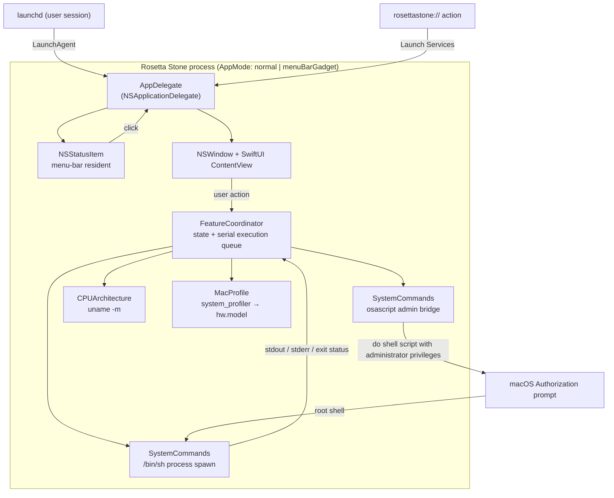
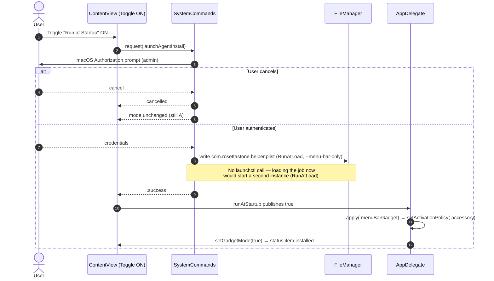
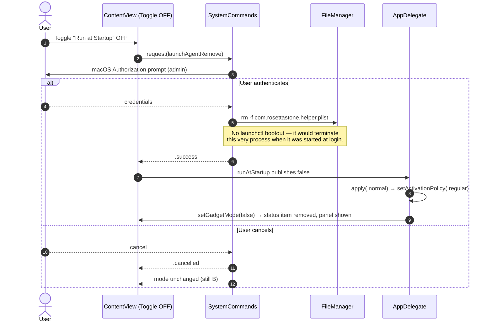
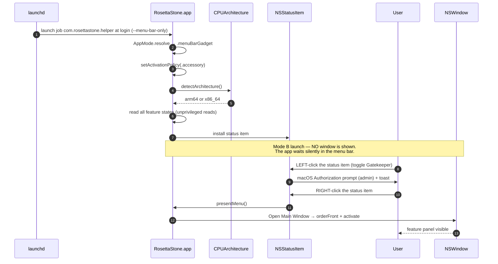
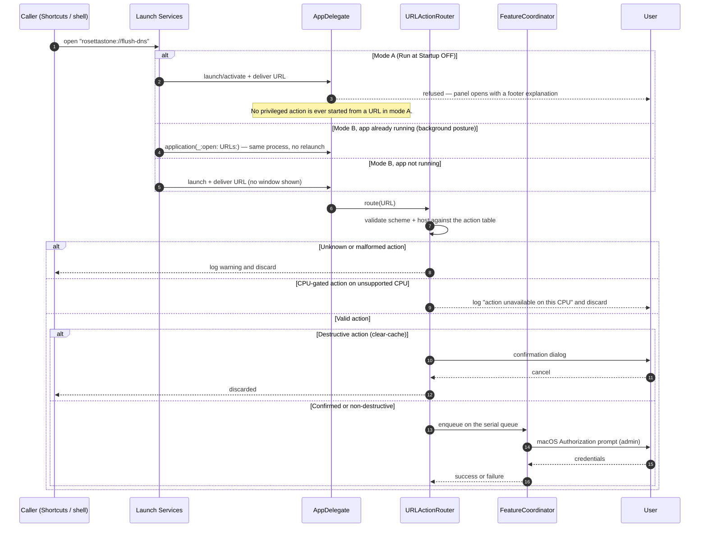
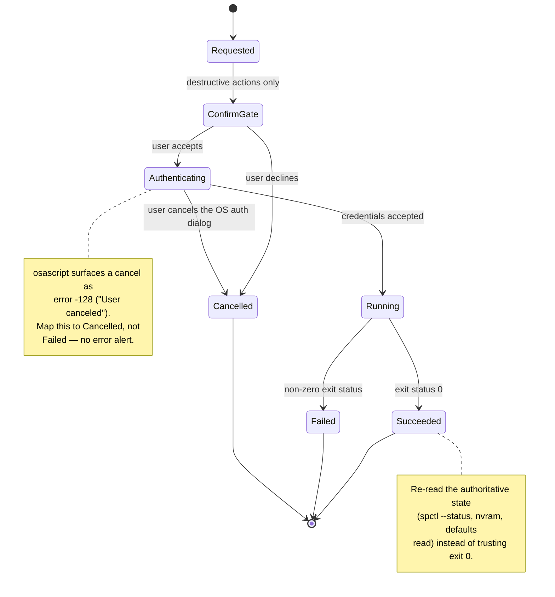
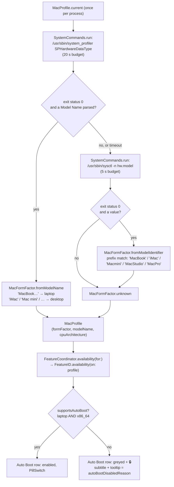
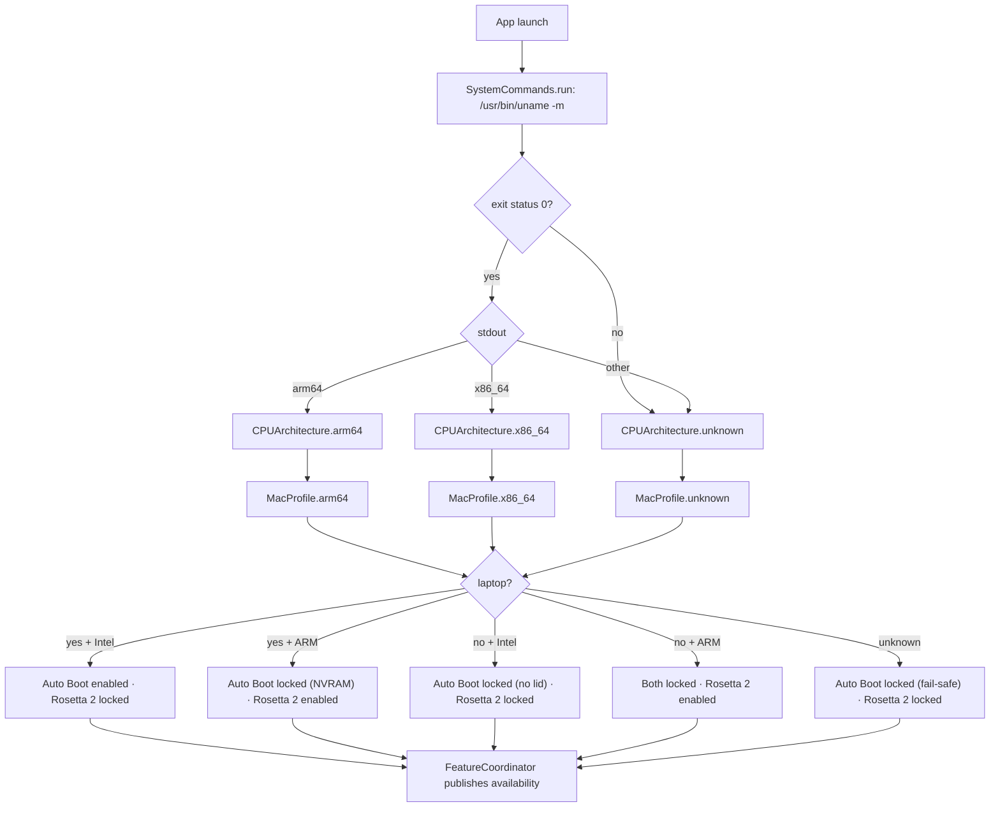

# Architecture

Rosetta Stone is a single-process, single-window-plus-menu-bar macOS application. This document
describes the process model, the principal runtime flows, and the design constraints that make
those flows possible on a macOS 10.15 deployment floor.

> **Type names below are the real ones.** The implementation is in `RosettaStone/`; the tables and
> diagrams name the actual Swift types — `SystemCommands`, `FeatureCoordinator`, `MenuBarController`,
> `CPUArchitecture`, `StartupManager`, `SystemStateReader`, `URLActionRouter`, `AppMode`,
> `GatekeeperPolicy`, `Trace` — not the scaffolding-era placeholders.

---

## 1. Process model

Rosetta Stone is one app process with two user-facing surfaces:

| Surface | Implementation | Visible as |
|---------|----------------|------------|
| Main window | SwiftUI view hosted in an `NSWindow` | The feature panel — always built, shown on demand |
| Menu-bar item | AppKit `NSStatusItem` | A status-bar glyph, present only in mode B |

### Two modes, one process

The **Run at Startup** toggle is the app's posture switch (`Models/AppMode.swift`):

| Mode | Trigger | Window at launch | Dock icon | Menu-bar icon | URL actions |
|------|---------|------------------|-----------|---------------|-------------|
| **A — normal app** (default) | No LaunchAgent plist and no `--menu-bar-only` | Shown | Yes (`.regular`) | None | Refused |
| **B — menu-bar gadget** | LaunchAgent plist exists, or `--menu-bar-only` | Hidden | No (`.accessory`) | Always | All seven work |

The mode is re-derived from `FeatureCoordinator.runAtStartup` after every operation, so
`AppDelegate.apply(_:)` flips the running process between the two postures with **no relaunch**:

- **OFF → ON:** install the login item, install the status item, drop to `.accessory` (the Dock
  icon disappears). The panel the user is looking at stays open; the *next* launch is hidden.
- **ON → OFF:** delete the login item, remove the status item **in-process** ("kill the
  menu-bar icon"), restore `.regular` and bring the panel forward.

Removal must happen in-process: `launchctl bootout` would terminate the very process performing
it, because in mode B that process was started by the LaunchAgent (§2).

### `LSUIElement = true` and the dynamic activation policy

`Info.plist` sets `LSUIElement` to `true`, which makes the process an **agent app by default**:

| Consequence | Detail |
|-------------|--------|
| No Dock icon | The process cannot leak a Dock tile by accident — the bulletproof half of mode B |
| No app menu | No standard menu bar; mode B supplies its own status-item menu |
| Activation policy | Mode B keeps `.accessory`; mode A calls `NSApp.setActivationPolicy(.regular)` at launch, which is what gives the Dock icon back |

### Mode B interaction contract

| Gesture | Result |
|---------|--------|
| **Left-click** the status item | **Toggle Gatekeeper directly** — no dropdown, no window; the macOS password prompt is the only interruption, and a toast (`StatusItemToast`) reports the outcome |
| **Right-click / Control-click** the status item | The full menu: Open Main Window, Toggle Hidden Files, Flush DNS, Rebuild Spotlight, Clear System Cache… (confirmed), Diagnostics… (⌘D), Quit (⌘Q) |
| Dock icon / reopen (mode A) | `applicationShouldHandleReopen` shows the panel |
| `rosettastone://…` (mode B) | Routed to the coordinator — §3 |
| Window close (either mode) | The process keeps running; `applicationShouldTerminateAfterLastWindowClosed` is `false` |

### Process diagram



### Concurrency model

A single **serial execution queue** owns every state-mutating operation. This is not an
optimisation — it is a correctness requirement:

- Two simultaneous `osascript` elevation prompts would fight for focus and could leave the
  authorization database in a confusing state.
- Read-modify-write sequences (read `nvram AutoBoot`, then write a new value) must not interleave.
- A single actor also makes the URL-scheme path and the UI path trivially safe: both funnel into
  the same serialised coordinator.

Long-running commands (Rosetta install, Spotlight rebuild) execute on a background queue and
publish progress back to the main actor; the UI shows a spinner but remains responsive.

---

## 2. LaunchAgent startup flow

The **Run at Startup** feature is implemented with a per-user `LaunchAgent` plist at
`~/Library/LaunchAgents/com.rosettastone.helper.plist`. A `LaunchAgent` (as opposed to a
`LaunchDaemon`) is correct here: it runs in the user's Aqua session, so it can present UI and
status-bar items. A daemon would run in a non-GUI context and could not.

### Generated plist (key fields)

| Key | Value | Reason |
|-----|-------|--------|
| `Label` | `com.rosettastone.helper` | Reverse-DNS label; also the `launchctl` job name |
| `ProgramArguments` | `["/Applications/RosettaStone.app/Contents/MacOS/RosettaStone", "--menu-bar-only"]` | Absolute path — the agent inherits no usable `PATH`. The binary is **exec'd directly**, never via `open -a`, which is an indirect launch that can be swallowed by Launch Services and that loses the process arguments |
| `RunAtLoad` | `true` | Launch as soon as the user logs in |
| `ProcessType` | `Interactive` | Allows UI / status-bar presentation |
| `LimitLoadToSessionType` | `Aqua` | Prevents launch in SSH / background sessions |

### Mode resolution at launch

`AppMode.resolve(menuBarOnlyArgument:launchAgentInstalled:)` reads two signals, in order:

1. **`--menu-bar-only`** (written by this plist) → mode B, unconditionally. The login launch
   never depends on a second read of the plist.
2. **The plist exists** → mode B. This is what makes a manual double-click while the toggle is
   ON behave exactly like the login launch: hidden window, menu-bar icon, no Dock icon.
3. Otherwise → mode A.

There is no separate "interactive launch" posture any more: the panel is shown on demand in both
modes (`Open Main Window`, `rosettastone://open-app`, or a reopen event), and a mode B launch
never shows a window as a side effect. A plist written by an older build lacks the flag but still
resolves to mode B through its existence; **Diagnostics…** flags it as an older-build item.

### Why no `launchctl` calls

| Call | Why it is not used |
|------|--------------------|
| `launchctl bootstrap` / `load` at install | The job is `RunAtLoad`, so loading it would start a **second instance immediately** — alongside the one performing the install. The running process *is* the gadget; the file only has to exist for launchd, which loads every plist in `~/Library/LaunchAgents` at the next login by itself. |
| `launchctl bootout` / `unload` at removal | It terminates a running job. The at-login instance is the one performing the removal, so this would kill the app mid-operation instead of letting it remove its menu-bar icon and return to normal mode. Deleting the plist is sufficient; the loaded job cannot restart the app (no `KeepAlive`) and is not loaded again at the next login. |

### Enable sequence



### Disable sequence



### Login-time sequence



---

## 3. URL-scheme handling flow

Rosetta Stone registers the custom scheme `rosettastone` via `CFBundleURLTypes` in `Info.plist`.
A custom URL scheme is used **instead of App Intents**, which requires macOS 13+ and would break
the 10.15 deployment floor (see [DECISIONS.md](DECISIONS.md#adr-002)).

### Registered actions

| Action string | Full URL | Maps to | Elevation |
|---------------|----------|---------|-----------|
| `open-app` | `rosettastone://open-app` | Show + focus the main window | No |
| `toggle-gatekeeper` | `rosettastone://toggle-gatekeeper` | Feature 2 | **Yes** (admin) |
| `toggle-hidden-files` | `rosettastone://toggle-hidden-files` | Feature 3 | No |
| `flush-dns` | `rosettastone://flush-dns` | Feature 7 | **Yes** (admin) |
| `rebuild-spotlight` | `rosettastone://rebuild-spotlight` | Feature 6 | **Yes** (admin) |
| `clear-cache` | `rosettastone://clear-cache` | Feature 8 | **Yes** (admin) |
| `install-rosetta` | `rosettastone://install-rosetta` | Feature 5 | **Yes** (admin) |

There is deliberately **no** URL action for `run-at-startup` or `auto-boot`: both change boot and
login behaviour, and exposing them to an untrusted URL caller without an in-app confirmation
would be unsafe. Feature 8 (`clear-cache`) *is* exposed but retains its confirmation dialog even
when URL-driven.

### Mode gate

URL actions are part of **mode B**. In mode A (Run at Startup OFF) the app is not running in the
background; a URL that arrives anyway is refused, the panel is shown, and the footer explains
that URL actions require Run at Startup ON. Nothing is silently performed, and unknown/malformed
URLs still raise nothing at all.

### Cold-start queue

URLs that arrive before the presenter exists are held in a plain array — `pendingURLs`, ceiling
**10** entries, oldest dropped (`AppDelegate.enqueue(_:)`). It is drained exactly once, by
`drainPendingURLs()`, after `applicationDidFinishLaunching` has built the controller. There is no
re-dispatch and no `DispatchQueue.main.async` hop on that path, which is what makes both failure
modes impossible: a URL that can be lost, and a drain that can re-enter itself.

### Flow



### Single-instance guarantee

In mode B the app has no Dock icon, so the usual "click the Dock icon to focus an existing
instance" affordance does not exist; the URL-scheme handler is therefore also the app's
**activation** path. In mode A the Dock icon exists and `applicationShouldHandleReopen` owns
reactivation. Three rules follow:

1. Never `terminate`-and-relaunch to handle a URL. Deliver it to the running instance.
2. On a cold start triggered by a URL in mode B, do **not** show the window as a side effect —
   the caller asked for an *action*, not for a window. Only `rosettastone://open-app` (or a
   click/activation of the app) shows the panel.
3. The LaunchAgent install never bootstraps the job, precisely so a mode-B install cannot spawn
   a second instance on the spot (§2).

### URL parsing notes

- The action is the URL **host** component: `rosettastone://flush-dns` → host = `flush-dns`.
- Query and path components are ignored; `rosettastone://flush-dns?force=1` resolves to the same
  action, with `force` discarded rather than honoured.
- Matching is **case-insensitive** (`FLUSH-DNS` works) but never prefix-matched —
  `rosettastone://flush-dns-extra` must be rejected as unknown.
- Unknown actions must not raise a user-facing error. A shortcut that fires at 3 a.m. should never
  produce an alert the user did not ask for.

---

## 4. Privilege escalation strategy

Seven of eight features require root. Rosetta Stone uses the **only** escalation mechanism
available on macOS 10.15 without a privileged helper binary, a managed deployment profile, or an
Apple Developer ID installation:

```bash
osascript -e 'do shell script "<command>" with administrator privileges'
```

This delegates to `osascript`, which presents the standard macOS Authorization Services dialog and
then executes the command as root. The user sees a native, familiar credential prompt — there is no
in-app password field, and the app never handles a password.

### Why not the alternatives

| Alternative | Why rejected |
|-------------|--------------|
| In-app password field | Security anti-pattern: the app would handle a raw admin password. Breaks keychain and TCC best practice. |
| `SMJobBless` privileged helper | Requires a Developer ID certificate, a signed installer, and `SMPrivilegedExecutables` in `Info.plist`. Incompatible with ad-hoc distribution. |
| `osascript` + `with administrator privileges` | ✅ **Chosen.** Present since macOS 10.0; needs no certificate, no helper, no extra entitlement. |
| `sudo` via `NSTask` | `sudo` needs a TTY, and non-interactive sudo requires credential caching a GUI app cannot rely on. |

### Command transport

```
app → /usr/bin/osascript -e 'do shell script "…" with administrator privileges'
        → Authorization Services → root /bin/sh -c "…"
```

Because the inner command *is* interpreted by `/bin/sh`, the command builder must
**escape every interpolated value** (single-quote wrapping with `'\''` escaping) and must never
interpolate raw user input, runtime-discovered file names, or URL parameters.

### Elevated vs. unelevated matrix

| # | Feature | Elevation | Why |
|---|---------|-----------|-----|
| 1 | Run at Startup | **Yes** (admin) | The plist is written by a root shell so the install cannot be blocked by a read-only or sandboxed context; no `launchctl` call is made (§2) |
| 2 | Gatekeeper | **Yes** (admin) | `spctl --master-disable` requires root |
| 3 | Hidden Files | No | `defaults write com.apple.finder` and `killall Finder` work as the user |
| 4 | Auto Boot | **Yes** (admin) | `nvram` is root-only |
| 5 | Rosetta 2 | **Yes** (admin) | `softwareupdate --install-rosetta` is root-only |
| 6 | Spotlight Rebuild | **Yes** (admin) | `mdutil -E /` requires root |
| 7 | DNS Flush | **Yes** (admin) | `dscacheutil -flushcache` + `killall mDNSResponder` require root |
| 8 | Clear System Cache | **Yes** (admin) | `/Library/Caches` is not user-writable |

**State reads are unelevated in every case.** Reading `spctl --status`, `nvram AutoBoot`,
`defaults read`, or probing `/usr/libexec/oah/libRosettaRuntime` never prompts for a password.
The app must escalate only on *write*, so merely opening the window costs the user nothing.

### Result classification



---

## 5. Hardware detection

Availability for features 4 and 5 is driven by the cached `MacProfile`: the **model name**, the
**form factor** derived from it, and the **CPU architecture**. Feature 5 (Rosetta 2) is gated on the
architecture alone; feature 4 (Auto Boot) needs the architecture **and** the form factor, because every
Intel desktop passes `uname -m` yet has no lid and no usable `AutoBoot` variable.

### 5.1 CPU architecture (ADR-007)

Detected once at launch by running:

```bash
uname -m
```

| Output | Meaning | Feature 4 (Auto Boot) | Feature 5 (Rosetta 2) |
|--------|---------|----------------------|----------------------|
| `arm64` | Apple Silicon | ⛔ Disabled, greyed + 🔒 | ✅ Enabled (Install button) |
| `x86_64` | Intel | 🔶 **Architecture permits it** — the form factor decides the row | ⛔ Disabled, greyed |
| anything else | Unknown / future arch | ⛔ Disabled | ⛔ Disabled |

The Intel row above is deliberately ambiguous: `x86_64` is a *necessary* condition for Auto Boot, not
a sufficient one. `MacProfile.supportsAutoBoot` is the complete rule.

### 5.2 Mac profile (ADR-008)

The form factor is read from the model name, which comes from two unprivileged sources in order:



| Source | Gives | Why it is (not) the primary |
|--------|------|----------------------------|
| `system_profiler SPHardwareDataType` | The **marketing** model name (`MacBook Pro`, `iMac`, `Mac mini`) | ✅ Primary — it carries the product family on every machine, including Apple Silicon. |
| `sysctl -n hw.model` | The machine identifier (`MacBookPro18,3`, `Mac14,5`) | ⚠️ Fallback only — from the M-series generation Apple stopped encoding the family, so `Mac14,5` is unclassifiable and yields `.unknown`. |

Both sources are **read-only and unprivileged**, so opening the window still costs nothing
(§4). Parsing happens in Swift rather than through a `grep` pipeline, which keeps the command set
constants-only (layering rule 3, §6) and makes the parser testable off-macOS
(`tests/MacProfileTests.swift`).

An `.unknown` form factor **locks** the row rather than guessing — a greyed row that explains itself
is always better than a wrongly-enabled `nvram` write. Diagnostics reports *Model name*, *Form
factor*, *Auto Boot supported* and *Auto Boot lock reason*, so this decision is verifiable from a
copied report.

### 5.3 Detection flow



### Design rules for hardware detection

| Rule | Rationale |
|------|-----------|
| Detect **once** at launch and cache | The hardware cannot change while the process is alive; re-running on every render is wasted work. |
| Availability asks the **profile**, never the architecture alone | Auto Boot needs the form factor as well as the chip; `CPUArchitecture.supportsAutoBoot` was removed so there is exactly one rule. |
| Use the `libRosettaRuntime` probe — not `uname -m` — to decide the Rosetta 2 *installed* state | An `x86_64` result can also mean "an arm64 Mac already running under Rosetta 2", which would wrongly grey out the Rosetta 2 row. The filesystem probe is authoritative. |
| Unknown architecture **or** unknown model disables rather than guessing | Fail-safe default: enabling `nvram` writes on an unrecognised machine is not a reasonable guess. |
| Grey out, never hide | A visible lock icon explains *why* a feature is unavailable instead of making the user think the app is missing it. |
| Every lock carries a reason | A greyed row that cannot explain itself reads as a bug. `autoBootDisabledReason` feeds both the subtitle and the tooltip. |
| Guard the **write path** independently | `setAutoBoot` re-checks `x86_64` on its own, so the invariant holds even if the profile is wrong — it is reachable without touching the UI. |
| Hardware reads stay unprivileged | Both `uname -m`, `system_profiler` and `sysctl -n hw.model` are reads; opening the window must never prompt (§4). |

### Why `uname -m` and not alternatives

| Method | Verdict |
|--------|---------|
| `uname -m` (chosen) | ✅ POSIX, present since macOS 10.0, no API availability risk, one process spawn at launch. |
| `sysctlbyname("hw.optional.arm64")` | Available from 11.0 only — unusable on the 10.15 floor. |
| `ProcessInfo.processInfo.isTranslated` | Reports *process* translation, not host CPU. Correct for "am I under Rosetta", wrong for "what CPU is this Mac". |
| `#if arch(arm64)` | Compile-time. A single universal binary cannot branch on the host at runtime. |
| `NXGetLocalArchInfo()` | Deprecated since 10.9. |

### 5.4 Why `system_profiler` and not alternatives for the form factor

| Method | Verdict |
|--------|---------|
| `system_profiler SPHardwareDataType` (chosen) | Reports the **marketing** model name, which carries the product family on every machine. Unprivileged, present since 10.3, parsed in Swift. Slow on a cold cache, hence the 20 s budget and the fallback. |
| `sysctl -n hw.model` (fallback) | One fast scalar, and the family is still encoded on Intel — but **blind on M-series** (`Mac14,5`), which is exactly why it is not the primary. |
| `ioreg -rd1 -c IOPlatformExpertDevice` | Carries model and CPU, but the output format is undocumented and has shifted between releases. |
| `uname -m` | Answers the chip question only; it cannot distinguish a MacBook Pro from a Mac mini. |

---

## 6. Component map

| Path | Responsibility |
|------|----------------|
| `RosettaStone/App/` | `main.swift` (both entry points), `RosettaStoneApp`, `AppDelegate` — mode resolution, URL-scheme entry, reopen handling, live mode switching |
| `RosettaStone/Models/` | `FeatureID` + `FeatureAvailability` (row copy, hardware gating on `MacProfile`, clear-cache warning), `AppMode`, `CommandResult` / `ProcessResult` |
| `RosettaStone/Services/` | `SystemCommands` (the only place that spawns processes or elevates, plus the Gatekeeper version rule), `FeatureCoordinator` (+ `FeatureCoordinator+Actions`), `StartupManager`, `SystemStateReader`, `CPUArchitecture`, `MacProfile` (model name + form factor, ADR-008), `URLActionRouter`, `GatekeeperPolicy`, `Trace` |
| `RosettaStone/Views/Main/` | `ContentView` (toggle rows, Rosetta row, Quick Tools grid, footer), `Components`, `Theme` — including `TooltipHost`, the AppKit tooltip used by locked rows |
| `RosettaStone/Views/MenuBar/` | `MenuBarController` (status item, dropdown menu, panel window), `StatusItemToast`, `DiagnosticsPanel` |
| `RosettaStone/Support/` | `Info.plist`, `RosettaStone.entitlements` |

### Layering rules

1. **Views never spawn processes.** A view calls a service; it never touches `Process` or
   `NSAppleScript`.
2. **Only `SystemCommands.runAsAdmin(_:timeout:)` may call `osascript`.** Elevation is
   centralised so it can be audited, rate-limited, and serialised in one place.
3. **Only `SystemCommands` spawns processes** (`run`, `shell`, `runShell`). It is the single
   place where `PATH`, working directory, timeouts, and output truncation are defined.
4. **Every service exposes read and write separately**, and reads must be unprivileged.
5. **Services never touch UI state.** Results flow back through `FeatureCoordinator`, and
   anything the UI must present — the macOS 15+ Gatekeeper confirmation — crosses as a closure
   hook (`onGatekeeperNeedsConfirmation`) rather than an AppKit import.

---

## 7. Entitlements and sandboxing

| Entitlement | Value | Reason |
|-------------|-------|--------|
| `com.apple.security.app-sandbox` | `false` | The app must spawn arbitrary system tools (`spctl`, `nvram`, `mdutil`, …). A sandboxed app cannot. |
| `com.apple.security.cs.disable-library-validation` | `true` | Required for `osascript` interop when the hardened runtime is involved. |
| Hardened runtime | **off** | Library validation and the hardened runtime interfere with the `osascript` privilege bridge on 10.15. |

The app is distributed **ad-hoc signed** (`CODE_SIGN_IDENTITY = "-"`) and is **not notarized**.
Consequences are documented in [DECISIONS.md](DECISIONS.md#adr-003) and
[USER-GUIDE.md](USER-GUIDE.md#first-launch).

---

## 8. Error handling policy

| Failure class | Example | Handling |
|---------------|---------|----------|
| User cancelled auth | `osascript` error `-128` | Silent revert. **No** error alert. |
| Authentication failed | Wrong password, 3 strikes | Show an error; the OS has already locked out further attempts. |
| Command not found | `uname` missing (theoretical) | Treat as `unknown` architecture → fail-safe disabled UI. |
| Non-zero exit | `spctl` refused by MDM | Show stderr verbatim; re-read state and display reality. |
| Timeout | Rosetta install stalls | Offer cancel; the `softwareupdate` child is terminated. |
| State drift | Gatekeeper re-enabled by MDM | Re-read after every write; never trust the exit code alone. |


