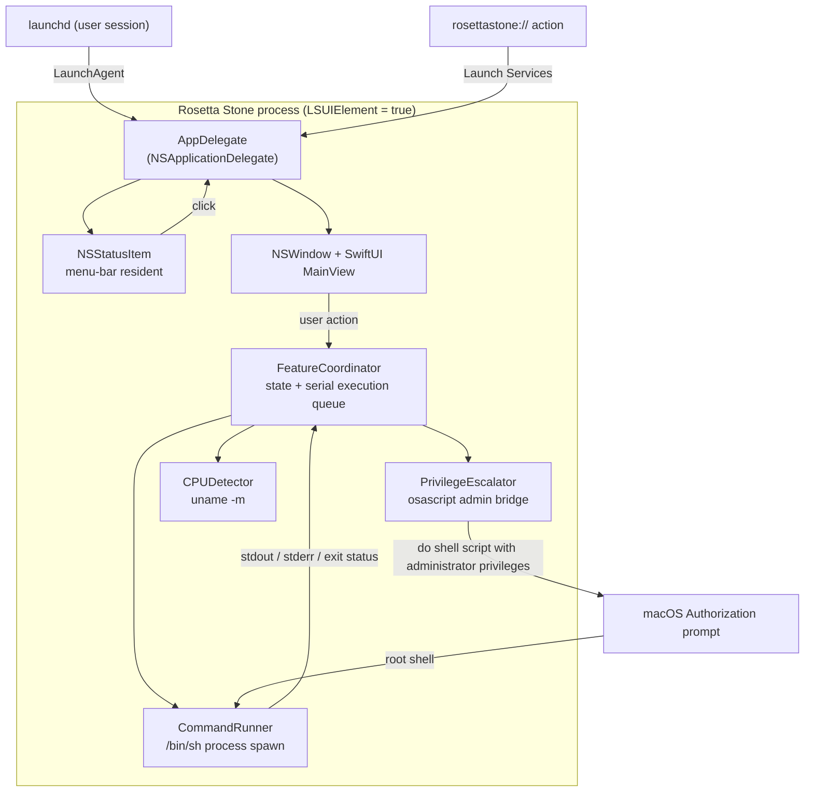
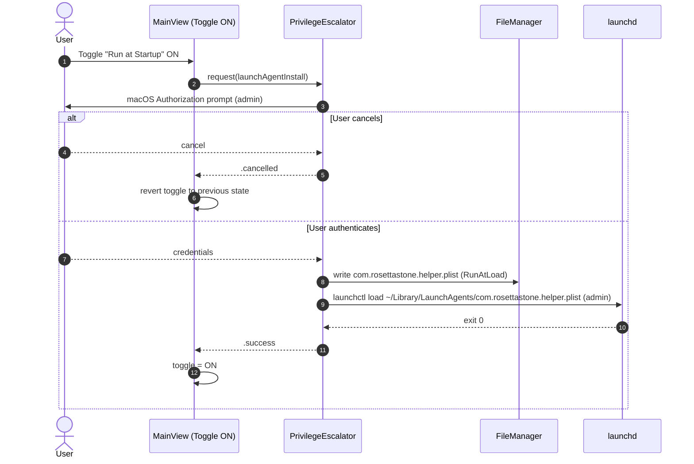
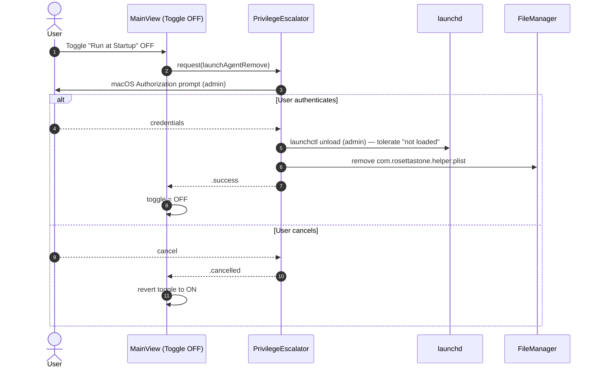
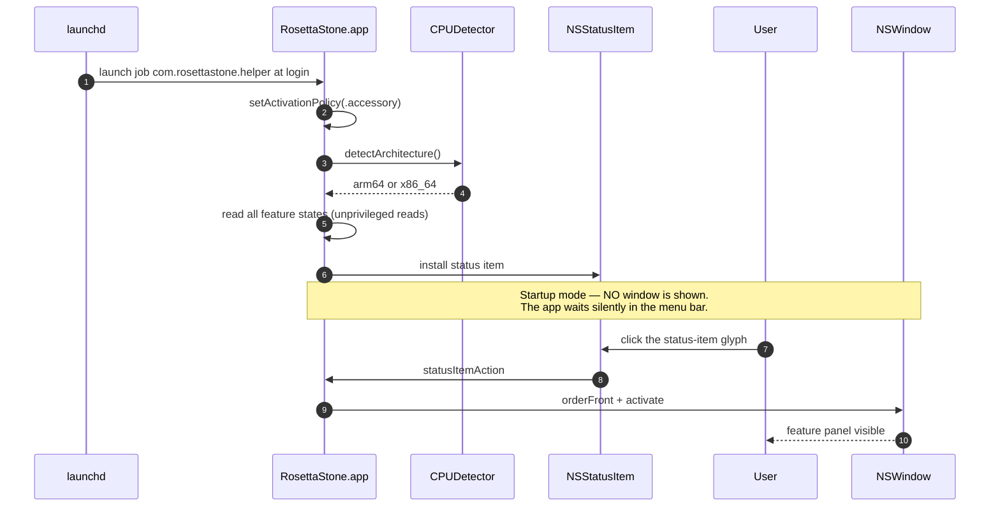
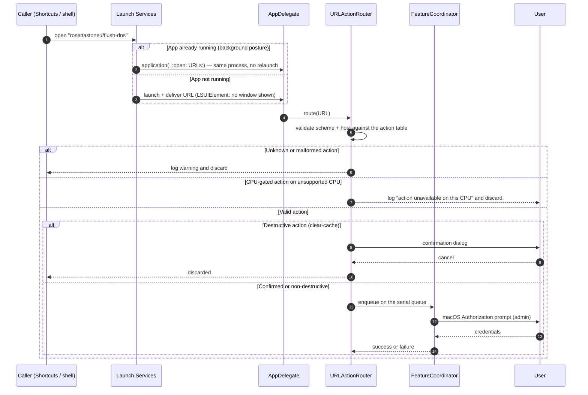
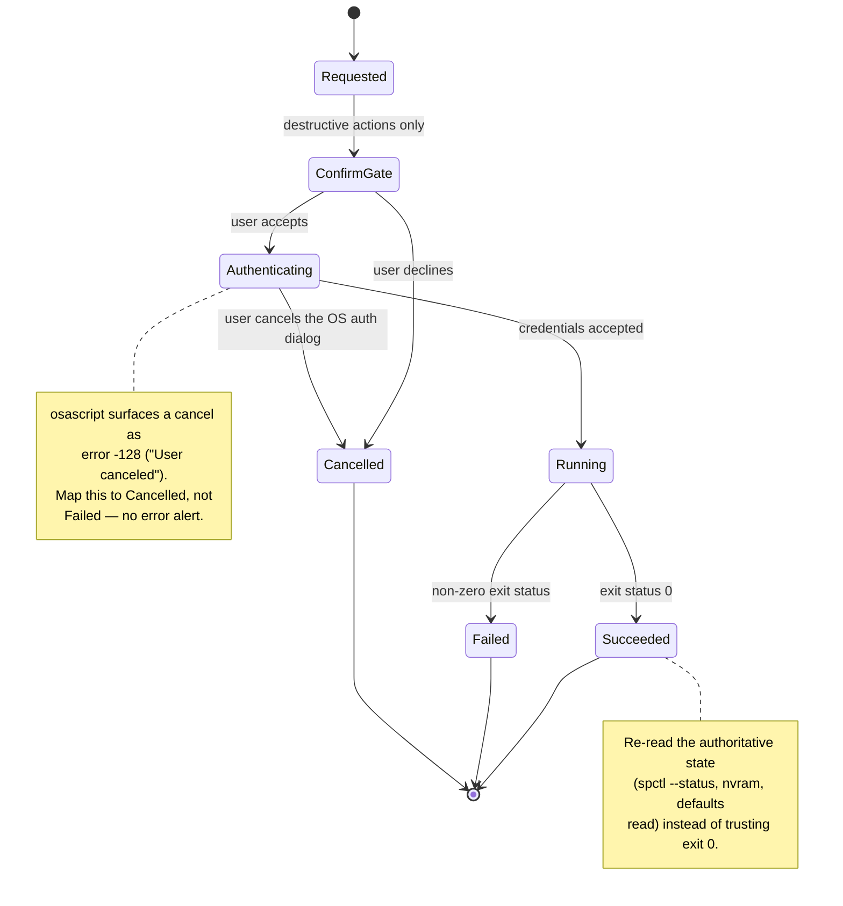
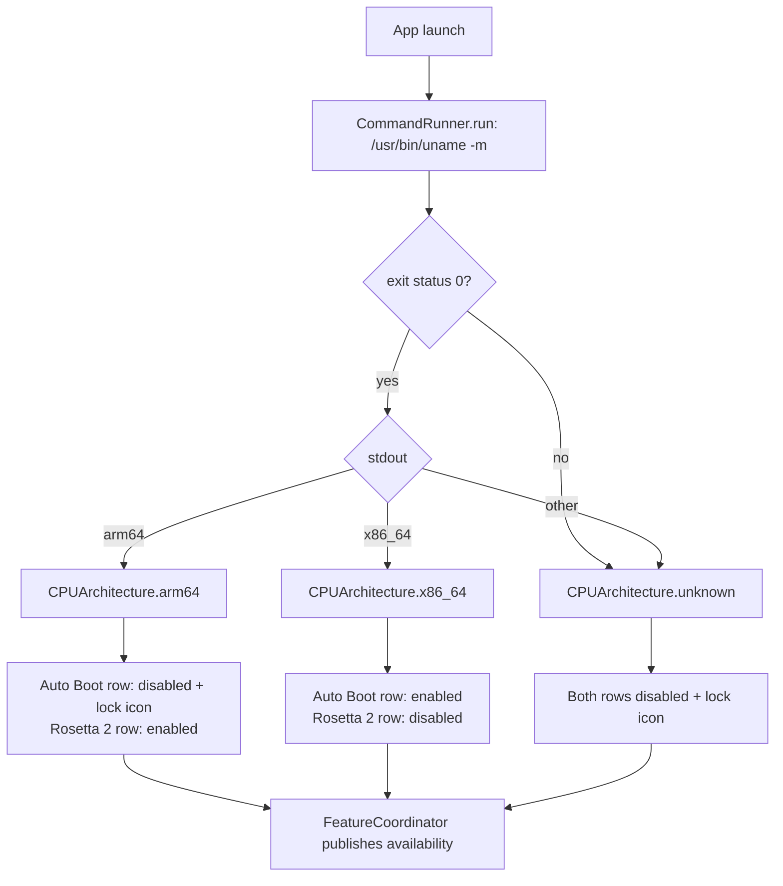

# Architecture

Rosetta Stone is a single-process, single-window-plus-menu-bar macOS agent application. This
document describes the process model, the four principal runtime flows, and the design constraints
that make those flows possible on a macOS 10.15 deployment floor.

> **Phase note.** This document is written during the scaffolding phase. It specifies the intended
> architecture; no Swift sources exist yet. Types named here (e.g. `CommandRunner`,
> `PrivilegeEscalator`, `FeatureCoordinator`) are the contracts the implementation phase must
> satisfy.

---

## 1. Process model

Rosetta Stone is one app process with two user-facing surfaces:

| Surface | Implementation | Visible as |
|---------|----------------|------------|
| Menu-bar item | AppKit `NSStatusItem` | A status-bar glyph, always present while running |
| Main window | SwiftUI view hosted in an `NSWindow` | The feature panel, shown on demand |

### `LSUIElement = true`

`Info.plist` sets `LSUIElement` to `true`, which makes the process an **agent app**:

| Consequence | Detail |
|-------------|--------|
| No Dock icon | The app never appears in the Dock or the ⌘-Tab switcher |
| No app menu | No standard menu bar; the app supplies its own status-item menu |
| Activation policy | `NSApp.setActivationPolicy(.accessory)` is the runtime equivalent and is set defensively in code as well |
| Startup mode | The app launches, shows **no window**, and waits in the menu bar |

The app deliberately has **two launch postures**:

| Posture | Trigger | Window | Menu-bar icon |
|---------|---------|--------|---------------|
| Background | Login item / `LaunchAgent`, or `LSUIElement` launch | Hidden | Visible |
| Interactive | `open rosettastone://open-app`, Dock/Launch Services activation, or a click on the status item | Visible + focused | Visible |

Switching from background to interactive **activates** the existing process rather than launching a
second copy. This is the central design problem the architecture must solve.

### Process diagram



### Concurrency model

A single **serial execution queue** owns every state-mutating operation. This is not an
optimisation — it is a correctness requirement:

- Two simultaneous `osascript` elevation prompts would fight for focus and could leave the
  authorization database in a confusing state.
- Read-modify-write sequences (read `nvram AutoBoot`, then write a new value) must not interleave.
- A single actor also makes the URL-scheme path and the UI path trivially safe: both funnel into
  the same serialised coordinator.

Long-running commands (Rosetta install, Spotlight rebuild) execute on a background queue and
publish progress back to the main actor; the UI shows a spinner but remains responsive.

---

## 2. LaunchAgent startup flow

The **Run at Startup** feature is implemented with a per-user `LaunchAgent` plist at
`~/Library/LaunchAgents/com.rosettastone.helper.plist`. A `LaunchAgent` (as opposed to a
`LaunchDaemon`) is correct here: it runs in the user's Aqua session, so it can present UI and
status-bar items. A daemon would run in a non-GUI context and could not.

### Generated plist (key fields)

| Key | Value | Reason |
|-----|-------|--------|
| `Label` | `com.rosettastone.helper` | Reverse-DNS label; also the `launchctl` job name |
| `ProgramArguments` | `/Applications/Rosetta Stone.app/Contents/MacOS/RosettaStone` | Absolute path — the agent inherits no usable `PATH` |
| `RunAtLoad` | `true` | Launch as soon as the user logs in |
| `ProcessType` | `Interactive` | Allows UI / status-bar presentation |
| `LimitLoadToSessionType` | `Aqua` | Prevents launch in SSH / background sessions |

### Enable sequence



### Disable sequence



### Login-time sequence



---

## 3. URL-scheme handling flow

Rosetta Stone registers the custom scheme `rosettastone` via `CFBundleURLTypes` in `Info.plist`.
A custom URL scheme is used **instead of App Intents**, which requires macOS 13+ and would break
the 10.15 deployment floor (see [DECISIONS.md](DECISIONS.md#adr-002)).

### Registered actions

| Action string | Full URL | Maps to | Elevation |
|---------------|----------|---------|-----------|
| `open-app` | `rosettastone://open-app` | Show + focus the main window | No |
| `toggle-gatekeeper` | `rosettastone://toggle-gatekeeper` | Feature 2 | **Yes** (admin) |
| `toggle-hidden-files` | `rosettastone://toggle-hidden-files` | Feature 3 | No |
| `flush-dns` | `rosettastone://flush-dns` | Feature 7 | **Yes** (admin) |
| `rebuild-spotlight` | `rosettastone://rebuild-spotlight` | Feature 6 | **Yes** (admin) |
| `clear-cache` | `rosettastone://clear-cache` | Feature 8 | **Yes** (admin) |
| `install-rosetta` | `rosettastone://install-rosetta` | Feature 5 | **Yes** (admin) |

There is deliberately **no** URL action for `run-at-startup` or `auto-boot`: both change boot and
login behaviour, and exposing them to an untrusted URL caller without an in-app confirmation
would be unsafe. Feature 8 (`clear-cache`) *is* exposed but retains its confirmation dialog even
when URL-driven.

### Flow



### Single-instance guarantee

Because `LSUIElement` apps have no Dock icon, the usual "click the Dock icon to focus an existing
instance" affordance does not exist. The URL-scheme handler is therefore also the app's
**activation** path. Two rules follow:

1. Never `terminate`-and-relaunch to handle a URL. Deliver it to the running instance.
2. On a cold start triggered by a URL, do **not** show the window as a side effect — the caller
   asked for an *action*, not for a window. Only `rosettastone://open-app` (or a click on the
   status item) shows the panel.

### URL parsing notes

- The action is the URL **host** component: `rosettastone://flush-dns` → host = `flush-dns`.
- Query and path components are ignored; `rosettastone://flush-dns?force=1` resolves to the same
  action, with `force` discarded rather than honoured.
- Matching is **case-insensitive** (`FLUSH-DNS` works) but never prefix-matched —
  `rosettastone://flush-dns-extra` must be rejected as unknown.
- Unknown actions must not raise a user-facing error. A shortcut that fires at 3 a.m. should never
  produce an alert the user did not ask for.

---

## 4. Privilege escalation strategy

Seven of eight features require root. Rosetta Stone uses the **only** escalation mechanism
available on macOS 10.15 without a privileged helper binary, a managed deployment profile, or an
Apple Developer ID installation:

```bash
osascript -e 'do shell script "<command>" with administrator privileges'
```

This delegates to `osascript`, which presents the standard macOS Authorization Services dialog and
then executes the command as root. The user sees a native, familiar credential prompt — there is no
in-app password field, and the app never handles a password.

### Why not the alternatives

| Alternative | Why rejected |
|-------------|--------------|
| In-app password field | Security anti-pattern: the app would handle a raw admin password. Breaks keychain and TCC best practice. |
| `SMJobBless` privileged helper | Requires a Developer ID certificate, a signed installer, and `SMPrivilegedExecutables` in `Info.plist`. Incompatible with ad-hoc distribution. |
| `osascript` + `with administrator privileges` | ✅ **Chosen.** Present since macOS 10.0; needs no certificate, no helper, no extra entitlement. |
| `sudo` via `NSTask` | `sudo` needs a TTY, and non-interactive sudo requires credential caching a GUI app cannot rely on. |

### Command transport

```
app → /usr/bin/osascript -e 'do shell script "…" with administrator privileges'
        → Authorization Services → root /bin/sh -c "…"
```

Because the inner command *is* interpreted by `/bin/sh`, the command builder must
**escape every interpolated value** (single-quote wrapping with `'\''` escaping) and must never
interpolate raw user input, runtime-discovered file names, or URL parameters.

### Elevated vs. unelevated matrix

| # | Feature | Elevation | Why |
|---|---------|-----------|-----|
| 1 | Run at Startup | **Yes** (admin) | `launchctl` in the user domain + plist write outside a sandboxed context |
| 2 | Gatekeeper | **Yes** (admin) | `spctl --master-disable` requires root |
| 3 | Hidden Files | No | `defaults write com.apple.finder` and `killall Finder` work as the user |
| 4 | Auto Boot | **Yes** (admin) | `nvram` is root-only |
| 5 | Rosetta 2 | **Yes** (admin) | `softwareupdate --install-rosetta` is root-only |
| 6 | Spotlight Rebuild | **Yes** (admin) | `mdutil -E /` requires root |
| 7 | DNS Flush | **Yes** (admin) | `dscacheutil -flushcache` + `killall mDNSResponder` require root |
| 8 | Clear System Cache | **Yes** (admin) | `/Library/Caches` is not user-writable |

**State reads are unelevated in every case.** Reading `spctl --status`, `nvram AutoBoot`,
`defaults read`, or probing `/usr/libexec/oah/libRosettaRuntime` never prompts for a password.
The app must escalate only on *write*, so merely opening the window costs the user nothing.

### Result classification



---

## 5. CPU detection

Availability for features 4 and 5 is driven entirely by the CPU architecture, detected once at
launch by running:

```bash
uname -m
```

| Output | Meaning | Feature 4 (Auto Boot) | Feature 5 (Rosetta 2) |
|--------|---------|----------------------|----------------------|
| `arm64` | Apple Silicon | ⛔ Disabled, greyed + 🔒 | ✅ Enabled (Install button) |
| `x86_64` | Intel | ✅ Enabled (toggle) | ⛔ Disabled, greyed |
| anything else | Unknown / future arch | ⛔ Disabled | ⛔ Disabled |



### Design rules for CPU detection

| Rule | Rationale |
|------|-----------|
| Detect **once** at launch and cache | The architecture cannot change while the process is alive; re-running on every render is wasted work. |
| Use the `libRosettaRuntime` probe — not `uname -m` — to decide the Rosetta 2 *installed* state | An `x86_64` result can also mean "an arm64 Mac already running under Rosetta 2", which would wrongly grey out the Rosetta 2 row. The filesystem probe is authoritative. |
| Unknown architecture disables features rather than guessing | Fail-safe default: enabling `nvram` writes on an unrecognised machine is not a reasonable guess. |
| Grey out, never hide | A visible lock icon explains *why* a feature is unavailable instead of making the user think the app is missing it. |

### Why `uname -m` and not alternatives

| Method | Verdict |
|--------|---------|
| `uname -m` (chosen) | ✅ POSIX, present since macOS 10.0, no API availability risk, one process spawn at launch. |
| `sysctlbyname("hw.optional.arm64")` | Available from 11.0 only — unusable on the 10.15 floor. |
| `ProcessInfo.processInfo.isTranslated` | Reports *process* translation, not host CPU. Correct for "am I under Rosetta", wrong for "what CPU is this Mac". |
| `#if arch(arm64)` | Compile-time. A single universal binary cannot branch on the host at runtime. |
| `NXGetLocalArchInfo()` | Deprecated since 10.9. |

---

## 6. Component map

| Path | Responsibility |
|------|----------------|
| `RosettaStone/App/` | `App` entry point, `AppDelegate`, URL-scheme entry, status-item setup |
| `RosettaStone/Models/` | `FeatureID`, `CPUArchitecture`, `FeatureState`, `CommandResult` |
| `RosettaStone/Services/System/` | `CommandRunner`, `CPUDetector`, `LaunchAgentService`, per-feature services |
| `RosettaStone/Services/Privileges/` | `PrivilegeEscalator` — the single choke point for `osascript` elevation |
| `RosettaStone/Views/Main/` | SwiftUI main window: toggle rows, Rosetta row, Quick Tools grid |
| `RosettaStone/Views/MenuBar/` | `NSStatusItem` view and its popover/menu |
| `RosettaStone/Support/` | `Info.plist`, `RosettaStone.entitlements` |

### Layering rules

1. **Views never spawn processes.** A view calls a service; it never touches `Process` or
   `NSAppleScript`.
2. **Only `PrivilegeEscalator` may call `osascript`.** Elevation is centralised so it can be
   audited, rate-limited, and serialised in one place.
3. **Only `CommandRunner` spawns processes.** It is the single place where `PATH`, working
   directory, timeouts, and output truncation are defined.
4. **Every service exposes read and write separately**, and reads must be unprivileged.
5. **Services never touch UI state**; results flow back through `FeatureCoordinator`.

---

## 7. Entitlements and sandboxing

| Entitlement | Value | Reason |
|-------------|-------|--------|
| `com.apple.security.app-sandbox` | `false` | The app must spawn arbitrary system tools (`spctl`, `nvram`, `mdutil`, …). A sandboxed app cannot. |
| `com.apple.security.cs.disable-library-validation` | `true` | Required for `osascript` interop when the hardened runtime is involved. |
| Hardened runtime | **off** | Library validation and the hardened runtime interfere with the `osascript` privilege bridge on 10.15. |

The app is distributed **ad-hoc signed** (`CODE_SIGN_IDENTITY = "-"`) and is **not notarized**.
Consequences are documented in [DECISIONS.md](DECISIONS.md#adr-003) and
[USER-GUIDE.md](USER-GUIDE.md#first-launch).

---

## 8. Error handling policy

| Failure class | Example | Handling |
|---------------|---------|----------|
| User cancelled auth | `osascript` error `-128` | Silent revert. **No** error alert. |
| Authentication failed | Wrong password, 3 strikes | Show an error; the OS has already locked out further attempts. |
| Command not found | `uname` missing (theoretical) | Treat as `unknown` architecture → fail-safe disabled UI. |
| Non-zero exit | `spctl` refused by MDM | Show stderr verbatim; re-read state and display reality. |
| Timeout | Rosetta install stalls | Offer cancel; the `softwareupdate` child is terminated. |
| State drift | Gatekeeper re-enabled by MDM | Re-read after every write; never trust the exit code alone. |


