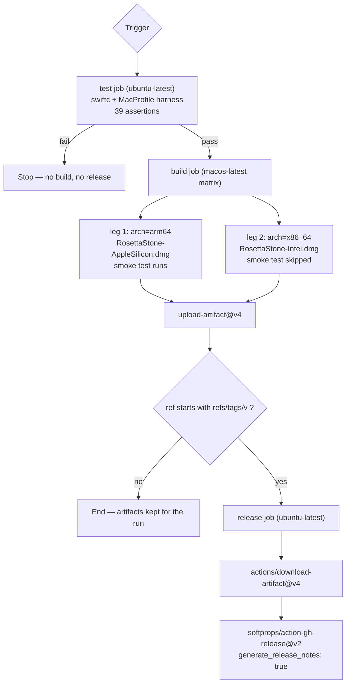

# CI/CD Pipeline

Workflow file: [`.github/workflows/build-mac-dmg.yml`](../.github/workflows/build-mac-dmg.yml)

This document explains every trigger, job, and step of the pipeline, in the order they execute.

The workflow began as a structural mirror of a reference .NET pipeline
(`setup-dotnet` → `dotnet publish` → hand-assembled `.app` → `codesign` →
`create-dmg` → verify → upload → release). Only the **build mechanism** differs:
`brew install xcodegen` → `xcodegen generate` → `xcodebuild`. Everything else —
triggers, matrix shape, ad-hoc signing, `create-dmg` flags, DMG verification,
artifact upload and the release job — is inherited from the reference unchanged.

> **Phase 7.2 added one job that is not from the reference:** a `test` job that runs the
> committed `MacProfile` harness (39 assertions) on `ubuntu-latest` and **gates the build**
> (`build.needs: test`). See §1 and [ADR-008](DECISIONS.md#adr-008).

---

## 1. Overview



| Aspect | Value |
|--------|-------|
| Runner (test) | `ubuntu-latest` — Swift 6.4 is preinstalled, no `setup-swift` needed |
| Runner (build) | `macos-latest` |
| Runner (release) | `ubuntu-latest` |
| Matrix legs | 2 (`arch=arm64`, `arch=x86_64`) |
| Tests | 39 assertions (`tests/MacProfileTests.swift`), run before the build |
| App bundle name | `RosettaStone.app` on **both** legs — never arch-suffixed |
| Output | Two `.dmg` artifacts, one per architecture (`RosettaStone-AppleSilicon.dmg`, `RosettaStone-Intel.dmg`) |
| Signing | Ad-hoc (`codesign --force --deep --sign -`) — no certificate required |
| Notarization | **None** — see [ADR-003](DECISIONS.md#adr-003) |
| Project source of truth | `project.yml` (`.xcodeproj` is generated, never committed) |

### Job: `test` (added in Phase 7.2)

```yaml
test:
  name: Test (MacProfile harness)
  runs-on: ubuntu-latest
  steps:
    - uses: actions/checkout@v4
    - name: Compile and run MacProfile harness
      run: |
        set -euo pipefail
        swift --version
        swiftc -swift-version 5 -o macprofile-tests tests/MacProfileTests.swift
        ./macprofile-tests
```

| Setting | Reason |
|---------|--------|
| `runs-on: ubuntu-latest`, not `macos-latest` | The harness is pure `Foundation` logic with no `Process` or `Darwin` dependency, so it runs anywhere. `ubuntu-latest` also ships Swift preinstalled, so this needs **no** extra action and costs seconds rather than minutes of macOS runner time. |
| `build.needs: test` | The gate runs **before** either matrix leg, not after. Auto Boot is the one rule in the app where a wrong answer writes permanent firmware settings, so there is no reason to spend two macOS builds discovering a logic regression — and `fail-fast` is irrelevant here because the legs never start. |
| `set -euo pipefail` | A non-zero exit from the harness fails the job. Without `-e`, a failing `./macprofile-tests` would be swallowed by the pipeline's default exit status. |
| The command is verbatim the file header's | If the workflow, the header and the README ever disagree, that is a documentation bug rather than a silently different test. |

---

## 2. Triggers

```yaml
on:
  workflow_dispatch:
  push:
    tags:
      - 'v*'
```

| Trigger | Behaviour |
|---------|-----------|
| `workflow_dispatch` | Manual run from the Actions tab. Lets a maintainer produce a DMG from any branch without creating a tag. No release is published (see §8). |
| `push` + `tags: v*` | Any push of a tag beginning with `v` — e.g. `v0.1.0`, `v0.2.0-rc1`. This is the **only** path that publishes a GitHub Release. |

Notes:

- A push to a **branch** does not run the workflow at all. There is no `pull_request` trigger, so
  ordinary development is unaffected by build cost.
- `v*` is a glob, so `v0.1.0`, `v1.0`, and `vanything` all match. There is no semver validation in
  the workflow; the tag name is trusted.
- Tag builds are the release path. The `build` job itself is identical in both cases; only the
  `release` job's `if` condition differs.

---

## 3. Job: `build`

| Property | Value | Why |
|----------|-------|-----|
| `runs-on` | `macos-latest` | `xcodebuild` and `create-dmg` are macOS-only tools. |
| `strategy.fail-fast` | `false` | If the arm64 leg fails, the x86_64 leg still runs. Otherwise a single failure would cancel the other architecture and cost you a release. |
| Paths | `build/` (DerivedData), `dist/` (deliverable) | DerivedData is throwaway scratch; `dist/` holds the per-leg `.app` and `.dmg` that later steps sign, image and upload. |

### 3.1 Matrix

```yaml
matrix:
  include:
    - arch: arm64
      output_name: RosettaStone-AppleSilicon
    - arch: x86_64
      output_name: RosettaStone-Intel
```

| Matrix key | Purpose | Consumer |
|------------|---------|----------|
| `arch` | Value passed to `xcodebuild ARCHS=` | The build step |
| `output_name` | Names the `.dmg` **file** and the **artifact** only | `create-dmg` (output argument), `upload-artifact` |

> **`output_name` does not name the app bundle.** Since Phase 8 the staged bundle is always
> `dist/RosettaStone.app`, so the installed app is always `/Applications/RosettaStone.app`. The
> suffix exists purely to tell two downloads apart in the Releases list. See §6.

Both legs run on `macos-latest`, an Apple Silicon machine. The `x86_64` leg therefore
**cross-compiles**: `xcodebuild` with `ARCHS=x86_64` emits Intel code on an arm64 host. This works
because Xcode ships both slices of the SDK; no Intel machine is required in CI.

---

## 4. Build job steps, in order

| # | Step | Action used | Purpose |
|---|------|-------------|---------|
| 1 | Checkout | `actions/checkout@v4` | Clone the repository at the triggering ref. |
| 2 | Install XcodeGen | `run` | `brew install xcodegen`. Replaces the reference workflow's `setup-dotnet`: both exist only to make a build toolchain available. |
| 3 | Generate Xcode project | `run` | `xcodegen generate --spec project.yml`, then `xcodebuild -list`. Replaces `dotnet restore`. |
| 4 | Build Swift app | `run` | The `xcodebuild` invocation. Replaces `dotnet publish`. |
| 5 | Collect app bundle | `run` | `cp -R` the built `.app` out of DerivedData into `dist/RosettaStone.app` — **no rename**. Replaces the reference workflow's hand-written `mkdir` + `cat Info.plist` + `PkgInfo` heredoc. |
| 6 | Ad-hoc codesign | `run` | `codesign --force --deep --sign -`, then verify. |
| 7 | Smoke test | `run` | Launches the signed binary twice (windowed + `--menu-bar-only`) and requires it to survive 5 s. Skipped when the runner arch ≠ the leg's arch. |
| 8 | Install create-dmg | `run` | `brew install create-dmg`. |
| 9 | Create DMG | `run` | Builds the drag-to-Applications disk image. Output keeps the arch suffix; the staged app does not. |
| 10 | Verify DMG | `run` | Fails with an `::error::` annotation if the DMG is missing or empty, then **mounts it and asserts it contains exactly one `.app` named `RosettaStone.app`**. |
| 11 | Upload DMG artifact | `actions/upload-artifact@v4` | Publishes the DMG as a run artifact. |

### Step 3 — Generate Xcode project

```bash
xcodegen generate --spec project.yml
xcodebuild -list -project RosettaStone.xcodeproj
```

`RosettaStone.xcodeproj` is a **generated artefact** and is not committed: a binary project file
cannot be reviewed in a diff, cannot be merged, and rots silently as files are added. `project.yml`
is the single source of truth, and both developers and CI reproduce the project from it
(`brew install xcodegen && xcodegen generate`).

`project.yml` marks the `RosettaStone` scheme `shared: true`. Without that, the scheme would live in
`xcuserdata` and be invisible to a clean checkout, so `xcodebuild -scheme RosettaStone` would fail.

`xcodebuild -list` prints the targets and schemes, which makes a `project.yml` mistake obvious in the
log before the build step rather than as a confusing compiler error.

### Step 4 — the `xcodebuild` invocation

```
xcodebuild \
  -project RosettaStone.xcodeproj \
  -scheme RosettaStone \
  -configuration Release \
  -derivedDataPath build \
  -destination "generic/platform=macOS" \
  ARCHS=<arm64|x86_64> \
  ONLY_ACTIVE_ARCH=NO \
  CODE_SIGNING_ALLOWED=NO \
  build
```

| Flag | Reason |
|------|--------|
| `-scheme RosettaStone` | Selects the shared scheme generated in step 3. |
| `-configuration Release` | The mode that is shipped; `Debug` would be needlessly slow and oversized. |
| `-derivedDataPath build` | Pins DerivedData to `build/`, so the product path in step 5 is stable and does not depend on the runner's home directory. |
| `-destination "generic/platform=macOS"` | Builds a redistributable product rather than one tuned to a specific connected Mac. |
| `ARCHS=<matrix.arch>` | The matrix leg's architecture. |
| `ONLY_ACTIVE_ARCH=NO` | Required — otherwise Xcode builds only for the host and the cross-compile leg produces an arm64 binary mislabelled as Intel. |
| `CODE_SIGNING_ALLOWED=NO` | The build signs nothing; the ad-hoc signature is applied in step 6, *after* the bundle has been copied to `dist/`. This keeps a certificate completely off the critical path and makes the sign step operate on the exact directory that is packaged. |
| `set -o pipefail` | Guards the step against a pipeline masking `xcodebuild`'s exit status. |

The product lands at `build/Build/Products/Release/RosettaStone.app` — the standard
`<derivedDataPath>/Build/Products/<configuration>/<PRODUCT_NAME>.app` layout, where `PRODUCT_NAME`
is the space-free `RosettaStone` set in `project.yml`. The user-facing name is still
**Rosetta Stone**, because `CFBundleDisplayName` in `Info.plist` is what Finder and the menu bar
display; the bundle *file* name is an implementation detail that the LaunchAgent and CI both key
off.

### Step 5 — Collect app bundle

```bash
BUNDLE="dist/RosettaStone.app"
mkdir -p dist
cp -R build/Build/Products/Release/RosettaStone.app "$BUNDLE"
ls -l "$BUNDLE/Contents"
```

The reference workflow assembled its `.app` by hand — `mkdir` the bundle skeleton, `cat` an
`Info.plist` in via a heredoc, write a `PkgInfo`. None of that is needed here: `xcodebuild` has
already produced a complete, correct bundle containing the executable, `Info.plist`, `PkgInfo` and
the compiled asset catalogue. Copying it is both simpler and less error-prone, because there is no
longhand plist to drift out of sync with the code.

The `Info.plist` inside the bundle is **not** written by the pipeline. It is
`RosettaStone/Support/Info.plist`, wired in by `INFOPLIST_FILE` in `project.yml`, and therefore
reviewed in the same diff as the rest of the source. `LSMinimumSystemVersion` stays `10.15`, and the
`GENERATE_INFOPLIST_FILE: NO` setting stops Xcode from synthesising a second, competing one.

### One bundle name, no per-leg rename

The bundle is **not** renamed per leg. `dist/RosettaStone.app` is the same path on both matrix legs,
because the `.app` name is what the user ends up seeing in `/Applications` after the drag, and a
name that changes with the chip — `RosettaStone-Intel.app` here, `RosettaStone-AppleSilicon.app`
there — leaks an implementation detail into the UI and makes support harder ("which one do I
delete?"). The architecture suffix is a **distribution** concern, so it stays on the `.dmg` and the
artifact name, and nowhere else.

### Step 6 — Ad-hoc codesign

```bash
BUNDLE="dist/RosettaStone.app"
codesign --force --deep --sign - "$BUNDLE"
codesign --verify --verbose=2 "$BUNDLE"
```

| Flag | Reason |
|------|--------|
| `--force` | Overwrite any signature left over from the build. |
| `--deep` | Sign nested code (frameworks, dylibs, XPC services) inside the bundle. |
| `--sign -` | The `-` means ad-hoc: sign with no identity. There is no Developer ID certificate in CI (ADR-003). |
| `--verify` | Fails the step if the signature is invalid, so a broken bundle never reaches a DMG. |

Signing happens **after** the bundle is copied into `dist/`, which is why step 4 can pass
`CODE_SIGNING_ALLOWED=NO`. The alternative — letting `xcodebuild` sign during the build — would make
the build depend on whatever identity happens to be on the runner, and would sign a bundle that is
then copied rather than the one that is actually packaged.

The hardened runtime stays off (ADR-003): library validation breaks the `osascript` privilege bridge
on the macOS 10.15 floor, and the app is not sandboxed precisely because it must be able to spawn
`spctl`, `nvram`, `mdutil`, `softwareupdate` and `osascript`.

### Step 7 — Smoke test (launch and stay alive)

```bash
BUNDLE="dist/RosettaStone.app"
BIN="$BUNDLE/Contents/MacOS/RosettaStone"

RUNNER_ARCH="$(uname -m)"
if [ "$RUNNER_ARCH" != "${{ matrix.arch }}" ]; then
  echo "::notice::skipping smoke test — leg builds ${{ matrix.arch }} but runner is ${RUNNER_ARCH}"
  exit 0
fi

for args in "" "--menu-bar-only"; do
  "$BIN" $args > smoke.log 2>&1 &
  PID=$!
  sleep 5
  # alive after 5s == pass; otherwise fail and dump smoke.log
done
```

| Element | Reason |
|---------|--------|
| Two launches, `""` and `--menu-bar-only` | The two modes enter `AppDelegate.init()` by different paths, and each is a separate way to die at launch. |
| `sleep 5`, then `kill -0 "$PID"` | Cheapest possible liveness check. A crash-on-launch dies in well under 5 s, so a still-running process after 5 s is the signal. |
| `smoke.log` captured and `cat`-ed on failure | The panic or trap message is otherwise lost, because a backgrounded GUI process writes nothing to the step log. |
| `uname -m` vs `matrix.arch` guard | The `x86_64` leg **cross-compiles on an arm64 runner**, so its binary cannot run natively. Skipping there is correct; failing would be a false alarm. The arm64 leg genuinely runs. |

This step exists because of a real bug: `AppDelegate` did not `override init()`, so
`@NSApplicationDelegateAdaptor` reached a Swift-synthesised stub that traps with
`EXC_BAD_INSTRUCTION` / SIGILL (exit 132). It compiled cleanly and only failed **at runtime**, on the
user's Intel Mac — which is exactly the class of defect a green build cannot catch.

### Step 9 — Create DMG

```bash
BUNDLE="dist/RosettaStone.app"
create-dmg \
  --volname "Rosetta Stone Installer" \
  --window-pos 200 120 \
  --window-size 600 400 \
  --icon-size 100 \
  --icon "RosettaStone.app" 150 190 \
  --hide-extension "RosettaStone.app" \
  --app-drop-link 450 190 \
  --no-internet-enable \
  "dist/${{ matrix.output_name }}.dmg" \
  "$BUNDLE" \
  || true
```

| Flag | Effect |
|------|--------|
| `--volname "Rosetta Stone Installer"` | Volume name shown when the DMG is mounted. |
| `--window-pos 200 120` | Position of the Finder window when the DMG opens. |
| `--window-size 600 400` | Finder window size inside the DMG. |
| `--icon-size 100` | Icon size, chosen to fit the 600×400 window comfortably. |
| `--icon "RosettaStone.app" 150 190` | Places the app icon at x=150, y=190. Referenced by **bundle name**, so it must match the staged `.app` exactly. |
| `--hide-extension "RosettaStone.app"` | Hides the `.app` extension, so the mounted volume shows a clean **Rosetta Stone** icon rather than `RosettaStone.app`. |
| `--app-drop-link 450 190` | Creates the **/Applications** symlink at x=450, y=190 — the standard drag-to-install target. |
| `--no-internet-enable` | Skips the `.DS_Store` background artwork step; deterministic and faster. |
| Final positional args | Output DMG path (keeps the arch suffix), then the source item to include. |
| `\|\| true` | Keep the step green if `create-dmg` exits non-zero while warning about quarantine attributes or permissions that are artifacts of building on a CI runner rather than defects in the image. The **next** step independently fails the job if the DMG is genuinely absent or empty, so this cannot mask a real failure. |

Note the asymmetry that Phase 8 introduced: the **source** is the architecture-neutral
`dist/RosettaStone.app`, while the **output** keeps `matrix.output_name`. Both the input and the
output are `dist/`-relative and absolute-by-prefix paths, so the step no longer needs `cd dist` —
the `BUNDLE` variable keeps the staged path and the arch-suffixed output name in one block, with no
chance of the two drifting apart.

### Step 10 — Verify DMG

The step asserts in two layers, because a DMG can exist and still be wrong.

| Check | Purpose |
|-------|---------|
| `[ ! -f "$DMG" ]` | The DMG was actually created. |
| `[ ! -s "$DMG" ]` | It is not zero bytes. A truncated or failed image is the realistic failure mode after the `\|\| true` in step 9. |
| `hdiutil attach -nobrowse -readonly` | Mounts the image read-only and invisible in Finder, so the real payload can be inspected. `-nobrowse` keeps the runner's Finder from reacting. |
| `find "$MOUNT_POINT" -maxdepth 1 -name '*.app'` | Lists the `.app` bundles at the volume root. `-maxdepth 1` deliberately ignores nested helpers such as `Contents/…/Helper.app`. |
| `APP_COUNT != 1` → `::error::` | Exactly one `.app` must be present. Two would mean a stale artefact was staged alongside the new build. |
| `APP_NAME != "RosettaStone.app"` → `::error::` | **The naming guarantee.** This is what makes the Phase 8 rule enforceable rather than aspirational: if any step ever renames the bundle again, the job fails here instead of shipping an `/Applications/RosettaStone-Intel.app` to users. |
| `echo "::error::…"` | Surfaces the failure as an annotation on the workflow run, so the cause is visible in the Actions UI and not only in the raw log. |
| `trap … EXIT` → `hdiutil detach` | Detaches on every exit path, including `exit 1`, so a failed assertion never leaves a mounted image behind on the runner. |

Failing here is the last line of defence: a missing, empty or wrongly-named DMG should never be
uploaded as an artifact or attached to a release. `if-no-files-found: error` in step 11 is the
second line.

### Step 11 — Upload artifact

```yaml
- uses: actions/upload-artifact@v4
  with:
    name: ${{ matrix.output_name }}-dmg
    path: dist/${{ matrix.output_name }}.dmg
    if-no-files-found: error
```

| Setting | Reason |
|---------|--------|
| `name: ${{ matrix.output_name }}-dmg` | One artifact per architecture. A shared name would make the second leg overwrite the first. |
| `path: dist/${{ matrix.output_name }}.dmg` | A single explicit file, so the archive cannot pick up stray intermediates. |
| `if-no-files-found: error` | If the DMG is missing, the job must fail rather than silently succeed with nothing to release. |

---

## 5. Job: `release`

```yaml
release:
  name: Publish GitHub Release
  needs: [test, build]
  if: startsWith(github.ref, 'refs/tags/v')
  runs-on: ubuntu-latest
```

| Setting | Reason |
|---------|--------|
| `needs: [test, build]` | Waits for **both** matrix legs **and** the MacProfile harness. If either architecture fails to build, or the Auto Boot gate regresses, no release is published — you never ship a half-release, and never ship one with a broken firmware gate. `build` already needs `test`, so this is belt-and-braces rather than the only link. |
| `if: startsWith(github.ref, 'refs/tags/v')` | The tag filter. A `workflow_dispatch` run builds and uploads artifacts but publishes nothing. This condition is the only difference between the two trigger paths. |
| `runs-on: ubuntu-latest` | Creating a release needs no macOS tooling, and it is cheaper and faster than a macOS runner. The DMGs are already built and uploaded as artifacts. |

### Step 1 — Download artifacts

```yaml
- uses: actions/download-artifact@v4
  with:
    path: dmgs
```

Each artifact is unpacked into its own subdirectory, so the layout is
`dmgs/RosettaStone-AppleSilicon-dmg/RosettaStone-AppleSilicon.dmg` and
`dmgs/RosettaStone-Intel-dmg/RosettaStone-Intel.dmg`. The release step's `dmgs/**/*.dmg` glob
matches both.

### Step 2 — Create the GitHub Release

```yaml
- uses: softprops/action-gh-release@v2
  with:
    files: dmgs/**/*.dmg
    generate_release_notes: true
```

| Input | Effect |
|-------|--------|
| `files: dmgs/**/*.dmg` | Attaches both DMGs to the release, matching the per-artifact directory layout produced in step 1. |
| `generate_release_notes: true` | GitHub auto-generates release notes from the commits and PRs since the previous tag. |

`GITHUB_TOKEN` is supplied automatically. The workflow declares `permissions: contents: write` at
the top level so this job is authorised to create the release.

---

## 6. Artifact and DMG naming

| Item | Value |
|------|-------|
| Built product | `build/Build/Products/Release/RosettaStone.app` |
| Packaged bundle | `dist/RosettaStone.app` — **same name on both legs** |
| Installed app | `/Applications/RosettaStone.app` — **same name on every Mac** |
| Apple Silicon DMG | `dist/RosettaStone-AppleSilicon.dmg` |
| Intel DMG | `dist/RosettaStone-Intel.dmg` |
| Artifact names | `RosettaStone-AppleSilicon-dmg` · `RosettaStone-Intel-dmg` |
| DMG volume name | `Rosetta Stone Installer` |

**The rule in one line:** the architecture suffix appears in the `.dmg` filename and the artifact
name, and **nowhere else** — never in the `.app` bundle name.

| Layer | Carries the arch suffix? | Why |
|-------|--------------------------|-----|
| DMG file name | **Yes** | Two downloads must be distinguishable at the Releases page (ADR-005). |
| Artifact name | **Yes** | The two uploads would otherwise overwrite each other. |
| `.app` bundle name | **No** | It is what the user sees in `/Applications`. A chip-specific name there is an implementation detail leaking into the UI, and it makes "which copy do I delete?" a support question. |
| `PRODUCT_NAME` in `project.yml` | **No** | Fixed at `RosettaStone`; the LaunchAgent path and CI both key off it. |

The DMG filename does not embed the version, so two runs of the same tag are distinguishable only by
content. The version *is* carried inside the bundle's `Info.plist` (`CFBundleShortVersionString` /
`CFBundleVersion`, from `project.yml`), so the built app always reports the right version. Adding the
tag to the filename is a small follow-up improvement, deliberately deferred to keep parity with the
reference workflow's naming.

---

## 7. Local reproduction

```bash
# 0) Run the MacProfile harness first -- this is what CI does before building
swiftc -swift-version 5 -o macprofile-tests tests/MacProfileTests.swift
./macprofile-tests

# 1) Generate the project and build a specific architecture
brew install xcodegen
xcodegen generate --spec project.yml

xcodebuild -project RosettaStone.xcodeproj -scheme RosettaStone \
           -configuration Release \
           -derivedDataPath build \
           -destination "generic/platform=macOS" \
           ARCHS=arm64 ONLY_ACTIVE_ARCH=NO \
           CODE_SIGNING_ALLOWED=NO build

# 2) Copy the product and ad-hoc sign it -- one bundle name, no per-leg rename
mkdir -p dist
BUNDLE="dist/RosettaStone.app"
cp -R build/Build/Products/Release/RosettaStone.app "$BUNDLE"
codesign --force --deep --sign - "$BUNDLE"
codesign --verify --verbose=2 "$BUNDLE"

# 3) Build and check the DMG -- source is the neutral bundle, output keeps the suffix
create-dmg --volname "Rosetta Stone Installer" --window-pos 200 120 \
  --window-size 600 400 --icon-size 100 \
  --icon "RosettaStone.app" 150 190 \
  --hide-extension "RosettaStone.app" \
  --app-drop-link 450 190 --no-internet-enable \
  dist/RosettaStone-AppleSilicon.dmg "$BUNDLE" || true

ls -lh dist/RosettaStone-AppleSilicon.dmg

# 4) Inspect the payload -- this is what CI asserts
MP="$(mktemp -d)"; hdiutil attach -nobrowse -readonly -mountpoint "$MP" \
  dist/RosettaStone-AppleSilicon.dmg
ls -1 "$MP"                 # expect: Applications  RosettaStone.app
hdiutil detach "$MP"
```

---

## 8. Release procedure

```bash
# 1) Ensure main is green
git switch main && git pull

# 2) Update CHANGELOG.md with the new version and date, then commit
git add CHANGELOG.md && git commit -m "docs: changelog for 0.1.0"

# 3) Tag — the tag push is what triggers the release
git tag -a v0.1.0 -m "Rosetta Stone 0.1.0"
git push origin main --tags

# 4) Watch the run
open https://github.com/pppoipoit/Rosetta_Stone/actions
```

Expected sequence: `build` runs twice (Apple Silicon, Intel) → each uploads a DMG artifact →
`release` downloads both and publishes the GitHub Release with generated notes.

### Rollback

If a release is bad, the tag and DMGs are immutable history in the sense that CI will not re-publish
over them. Publish a patch version instead:

```bash
# Fix on main, then
git tag -a v0.1.1 -m "Fixes packaging issue in 0.1.0"
git push origin main --tags
```

Then mark the `v0.1.0` release as a **prerelease** or delete it in the GitHub UI.

---

## 9. Security notes for the pipeline

| Concern | Mitigation |
|---------|------------|
| Secrets in the build | There are none. No certificate, no API token, no notarization credentials are stored in the repository. |
| `GITHUB_TOKEN` scope | Restricted to `contents: write` at workflow level rather than using the default broad token. |
| Untrusted code execution | `workflow_dispatch` and tag pushes both run `xcodebuild` on repository code. Only maintainers who can push tags can trigger it, and GitHub does not run workflows from forked PRs here (there is no `pull_request` trigger). |
| Supply chain | Actions are pinned to major-version tags (`@v4`, `@v2`). For stricter guarantees, pin to full commit SHAs. `xcodegen` is installed from Homebrew, which is the same trust level as the runner image itself. |
| Signature limitations | The build is ad-hoc signed. A user cannot verify publisher identity — this is inherent to ADR-003, not a pipeline defect. |
| No notarization | A first launch on another Mac may require Gatekeeper's "Open Anyway". The USER-GUIDE documents this. |

---
