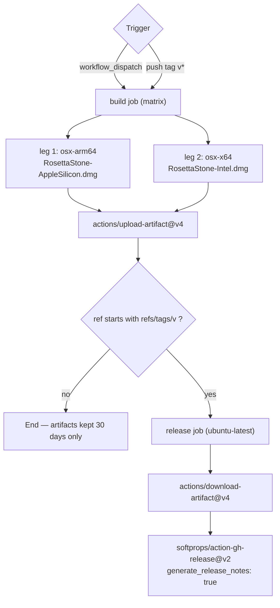

# CI/CD Pipeline

Workflow file: [`.github/workflows/build-mac-dmg.yml`](../.github/workflows/build-mac-dmg.yml)

This document explains every trigger, job, and step of the pipeline, in the order they execute.

---

## 1. Overview



| Aspect | Value |
|--------|-------|
| Runner (build) | `macos-latest` |
| Runner (release) | `ubuntu-latest` |
| Matrix legs | 2 (`osx-arm64`, `osx-x64`) |
| Output | Two `.dmg` artifacts, one per architecture |
| Signing | Ad-hoc (`codesign --sign -`) — no certificate required |
| Notarization | **None** — see [ADR-003](DECISIONS.md#adr-003) |

---

## 2. Triggers

```yaml
on:
  workflow_dispatch:
  push:
    tags:
      - 'v*'
```

| Trigger | Behaviour |
|---------|-----------|
| `workflow_dispatch` | Manual run from the Actions tab. Lets a maintainer produce a DMG from any branch without creating a tag. No release is published (see §8). |
| `push` + `tags: v*` | Any push of a tag beginning with `v` — e.g. `v0.1.0`, `v0.2.0-rc1`. This is the **only** path that publishes a GitHub Release. |

Notes:

- A push to a **branch** does not run the workflow at all. There is no `pull_request` trigger, so
  ordinary development is unaffected by build cost.
- `v*` is a glob, so `v0.1.0`, `v1.0`, and `vanything` all match. There is no semver validation in
  the workflow; the tag name is trusted.
- Tag builds are the release path. The `build` job itself is identical in both cases; only the
  `release` job's `if` condition differs.

---

## 3. Job: `build`

| Property | Value | Why |
|----------|-------|-----|
| `runs-on` | `macos-latest` | `xcodebuild` and `create-dmg` are macOS-only tools. |
| `strategy.fail-fast` | `false` | If the arm64 leg fails, the x64 leg still runs. Otherwise a single failure would cancel the other architecture and cost you a release. |
| `env` | `BUILD_DIR`, `APP_PATH`, `DMG_PATH` | Path variables are defined once at job scope so every step agrees on locations. |

### 3.1 Matrix

```yaml
matrix:
  include:
    - os: osx-arm64
      app_name: RosettaStone-AppleSilicon
      arch: arm64
    - os: osx-x64
      app_name: RosettaStone-Intel
      arch: x86_64
```

| Matrix key | Purpose | Consumer |
|------------|---------|----------|
| `os` | Runner architecture (documentation value; `runs-on: macos-latest` is shared) | Step labels |
| `app_name` | Artifact name **and** DMG filename | `upload-artifact`, `create-dmg` output path |
| `arch` | Value passed to `xcodebuild ARCHS=` | The build step |

Why per-architecture DMGs rather than one universal binary:

| Option | Verdict |
|--------|---------|
| Two single-arch DMGs (chosen) | Smallest download per machine, and each binary is genuinely single-arch so there is no risk of a Rosetta-translated launch. Matches the Intel + Apple Silicon support promise. |
| One universal DMG | ~2× the download size for users who need only one slice, and launching the "wrong" slice is a common source of confusion. |
| One DMG containing both apps | Confusing install UX: users must know which one to drag. |

Both legs run on `macos-latest`, an Apple Silicon machine. The `x86_64` leg therefore
**cross-compiles**: `xcodebuild` with `ARCHS=x86_64` emits Intel code on an arm64 host. This works
because Xcode ships both slices of the SDK; no Intel machine is required in CI.

---

## 4. Build job steps, in order

| # | Step | Action used | Purpose |
|---|------|-------------|---------|
| 1 | Checkout | `actions/checkout@v4` | Clone the repository at the triggering ref. |
| 2 | Clean previous build output | `run` | `rm -rf build` so a stale `.app` cannot leak into the DMG. |
| 3 | Show toolchain version | `run` | Prints `sw_vers` and `xcodebuild -version`. Diagnostic only; a failed build is far easier to triage when the Xcode version is in the log. |
| 4 | Select Xcode | `run` | Pins the toolchain to a fixed Xcode so a runner image update cannot silently change the compiler. Both matrix legs use the same Xcode and differ only by `ARCHS` at step 6. Falls back to the runner's default Xcode if the pinned path is absent, rather than failing. |
| 5 | Resolve Swift dependencies | `run` | `swift package resolve`, guarded by `if [ -f Package.swift ]`. Replaces the reference workflow's `dotnet restore`. |
| 6 | Build Swift app | `run` | The `xcodebuild` invocation. Replaces `dotnet publish`. |
| 7 | Collect app bundle | `run` | Moves the built `.app` out of `DerivedData` to `build/RosettaStone.app`. |
| 8 | Stamp version | `run` | Writes `CFBundleShortVersionString` / `CFBundleVersion` via `PlistBuddy`. |
| 9 | Ad-hoc codesign | `run` | `codesign --force --deep --sign -`, then verify. |
| 10 | Strip quarantine | `run` | `xattr -cr` removes attributes that would otherwise make the app appear "downloaded". |
| 11 | Install create-dmg | `run` | `brew install create-dmg`. |
| 12 | Create DMG | `run` | Builds the drag-to-Applications disk image. |
| 13 | Verify DMG | `run` | `hdiutil verify` + `7z l` + `ls -lh`. |
| 14 | Upload DMG artifact | `actions/upload-artifact@v4` | Publishes the DMG as a run artifact. |

### Step 6 — the `xcodebuild` invocation

```
xcodebuild \
  -project RosettaStone.xcodeproj \
  -scheme RosettaStone \
  -configuration Release \
  -destination "generic/platform=macOS" \
  -derivedDataPath build/DerivedData \
  ARCHS=<arm64|x86_64> \
  ONLY_ACTIVE_ARCH=NO \
  CODE_SIGN_IDENTITY="-" \
  CODE_SIGNING_REQUIRED=NO \
  CODE_SIGNING_ALLOWED=YES \
  clean build | xcbeautify
```

| Flag | Reason |
|------|--------|
| `-scheme RosettaStone` | Selects the shared scheme. It must be marked **Shared** in `xcshareddata/xcschemes`, or CI cannot see it. |
| `-destination "generic/platform=macOS"` | Builds a redistributable product rather than one tuned to a specific connected Mac. |
| `ARCHS=<matrix.arch>` | The matrix leg's architecture. |
| `ONLY_ACTIVE_ARCH=NO` | Required — otherwise Xcode builds only for the host and the cross-compile leg produces an arm64 binary mislabelled as Intel. |
| `CODE_SIGN_IDENTITY="-"` | Ad-hoc signature. No Developer ID certificate exists in CI (ADR-003). |
| `CODE_SIGNING_REQUIRED=NO` | Lets the build succeed even if Xcode's own signing phase wants a real identity. |
| `set -o pipefail` | Without it a failing `xcodebuild` is masked by `xcbeautify`'s exit status, and a broken build would sail through. |
| `\| xcbeautify` | Pretty-prints the log. Cosmetic only. |

> **Implementation-phase note.** The `-project RosettaStone.xcodeproj` path assumes an Xcode
> project is generated from the `RosettaStone/` folder layout during the implementation phase. No
> Swift sources exist yet, so this step will fail until then — by design.

### Step 4 — Select Xcode

```bash
XCODE="/Applications/Xcode_15.4.app"
if [ ! -d "$XCODE" ]; then
  echo "not found — falling back to the runner's Xcode" >&2
else
  sudo xcode-select -s "$XCODE"
fi
xcode-select -p
```

Pinning the toolchain prevents a routine GitHub runner image update from silently changing the
compiler and, with it, the output. Both matrix legs use the **same** Xcode — they differ only by the
`ARCHS` value in step 6 — so there is no per-architecture toolchain selection. The existence check
means a runner image that drops the pinned Xcode degrades to the runner default with a warning
rather than failing the build outright.

### Step 7 — Collect app bundle

`xcodebuild` writes to `DerivedData/Build/Products/Release/`, and the product directory name is
driven by `PRODUCT_NAME`, which may be `Rosetta Stone` (with a space) or `RosettaStone`. The step
probes both names and exits non-zero with a clear message if neither exists — better than silently
producing a DMG with no app in it.

### Step 8 — Stamp version

| Key | Value written | Source |
|-----|---------------|--------|
| `CFBundleShortVersionString` | Tag name with the leading `v` stripped | `${GITHUB_REF_NAME#v}`, falling back to `0.1.0` on a manual run |
| `CFBundleVersion` | Monotonic build counter | `${GITHUB_RUN_NUMBER}` |

`PlistBuddy` is used rather than a second `xcodebuild` pass because it edits the built bundle in
place — no rebuild, and the change is guaranteed to be in the DMG.

### Step 9 — Ad-hoc codesign

```bash
codesign --force --deep --sign - --timestamp=none build/RosettaStone.app
codesign --verify --verbose=2 build/RosettaStone.app
```

| Flag | Reason |
|------|--------|
| `--force` | Overwrite any signature left over from the build. |
| `--deep` | Sign nested code (frameworks, dylibs, XPC services) inside the bundle. |
| `--sign -` | The `-` means ad-hoc: sign with no identity. |
| `--timestamp=none` | Ad-hoc signatures have no signing authority to timestamp against; omitting this avoids an error. |
| `--verify` | Fails the step if the signature is invalid, so a broken bundle never reaches a DMG. |

### Step 12 — Create DMG

```bash
cd build
create-dmg \
  --volname "Rosetta Stone" \
  --window-size 660 400 \
  --icon-size 180 \
  --icon "Rosetta Stone.app" 180 170 \
  --app-drop-link 480 170 \
  --no-internet-enable \
  build/RosettaStone-AppleSilicon.dmg \
  "Rosetta Stone.app"
```

| Flag | Effect |
|------|--------|
| `--volname` | Volume name shown when the DMG is mounted. |
| `--window-size 660 400` | Finder window size inside the DMG. |
| `--icon "Rosetta Stone.app" 180 170` | Places the app icon at x=180, y=170. |
| `--app-drop-link 480 170` | Creates the **/Applications** symlink at x=480, y=170 — the standard drag-to-install target. |
| `--no-internet-enable` | Skips the `.DS_Store` background artwork step; deterministic and faster. |
| Final positional args | Output DMG path, then the source items to include. |

The `cd build` matters: `create-dmg` resolves the source item (`"Rosetta Stone.app"`) relative to
the current working directory, while the output path in `DMG_PATH` is already rooted at `build/`.

### Step 13 — Verify DMG

| Command | Checks |
|---------|--------|
| `hdiutil verify <dmg>` | The disk image checksum is valid; the image is not corrupt or truncated. |
| `7z l <dmg>` | The image's contents are listable and readable — catches an empty or mis-specified image. |
| `ls -lh <dmg>` | Records the size in the log, so a 0-byte or absurdly large DMG is obvious. |

Failing here is the last line of defence: a corrupt DMG should never be uploaded as an artifact or
attached to a release.

### Step 14 — Upload artifact

```yaml
- uses: actions/upload-artifact@v4
  with:
    name: ${{ matrix.app_name }}
    path: ${{ env.DMG_PATH }}
    if-no-files-found: error
    retention-days: 30
```

| Setting | Reason |
|---------|--------|
| `name: ${{ matrix.app_name }}` | One artifact per architecture. A shared name would make the second leg overwrite the first. |
| `if-no-files-found: error` | If the DMG is missing, the job must fail rather than silently succeed with nothing to release. |
| `retention-days: 30` | Manual (non-tag) runs do not produce a release, so the artifact self-expires. |

---

## 5. Job: `release`

```yaml
release:
  name: Publish GitHub Release
  needs: build
  if: startsWith(github.ref, 'refs/tags/v')
  runs-on: ubuntu-latest
```

| Setting | Reason |
|---------|--------|
| `needs: build` | Waits for **both** matrix legs. If either architecture fails to build, no release is published — you never ship a half-release. |
| `if: startsWith(github.ref, 'refs/tags/v')` | The tag filter. A `workflow_dispatch` run builds and uploads artifacts but publishes nothing. This condition is the only difference between the two trigger paths. |
| `runs-on: ubuntu-latest` | Creating a release needs no macOS tooling, and it is cheaper and faster than a macOS runner. The DMGs are already built and uploaded as artifacts. |

### Step 1 — Download artifacts

```yaml
- uses: actions/download-artifact@v4
  with:
    path: artifacts
    merge-multiple: true
```

| Setting | Reason |
|---------|--------|
| `path: artifacts` | Everything lands in one directory. |
| `merge-multiple: true` | Flattens the per-architecture artifacts into a single `artifacts/` folder. Without it you would get `artifacts/RosettaStone-AppleSilicon/…` and `artifacts/RosettaStone-Intel/…`, and the `files: artifacts/*.dmg` glob would match nothing. |

### Step 2 — Create the GitHub Release

```yaml
- uses: softprops/action-gh-release@v2
  with:
    files: artifacts/*.dmg
    generate_release_notes: true
    draft: false
    prerelease: false
```

| Input | Effect |
|-------|--------|
| `files: artifacts/*.dmg` | Attaches both DMGs to the release. The glob works precisely because of `merge-multiple: true`. |
| `generate_release_notes: true` | GitHub auto-generates release notes from the commits and PRs since the previous tag. |
| `draft: false` | Publishes immediately. |
| `prerelease: false` | A `v*` tag is treated as a real release. For an RC, the convention is to tag `v0.2.0-rc1` and either accept the release as final or set this flag. |

`GITHUB_TOKEN` is supplied automatically. The workflow declares `permissions: contents: write` at
the top level so this job is authorised to create the release.

---

## 6. Artifact and DMG naming

| Item | Value |
|------|-------|
| `.app` bundle | `RosettaStone.app` |
| Apple Silicon DMG | `RosettaStone-AppleSilicon-<tag>.dmg` in practice; the workflow names it `RosettaStone-AppleSilicon.dmg` under `build/` |
| Intel DMG | `RosettaStone-Intel.dmg` |
| Artifact names | `RosettaStone-AppleSilicon`, `RosettaStone-Intel` |

> **Known limitation.** `DMG_PATH` currently does not embed the version, so the two artifacts of a
> re-run of the same tag are byte-distinguishable only by content. The version *is* stamped inside
> the app bundle's `Info.plist` (step 8), so the built app always reports the right version. Adding
> the tag to the filename is a small follow-up improvement, deliberately deferred to keep parity
> with the reference .NET workflow.

---

## 7. Local reproduction

```bash
# 1) Build a specific architecture
xcodebuild -project RosettaStone.xcodeproj -scheme RosettaStone \
           -configuration Release -destination "generic/platform=macOS" \
           -derivedDataPath build/DerivedData \
           ARCHS=arm64 ONLY_ACTIVE_ARCH=NO \
           CODE_SIGN_IDENTITY="-" CODE_SIGNING_REQUIRED=NO \
           clean build

# 2) Move the product
mv build/DerivedData/Build/Products/Release/Rosetta\ Stone.app build/RosettaStone.app

# 3) Ad-hoc sign
codesign --force --deep --sign - --timestamp=none build/RosettaStone.app

# 4) Build the DMG
cd build && create-dmg --volname "Rosetta Stone" --window-size 660 400 \
  --icon-size 180 --icon "Rosetta Stone.app" 180 170 \
  --app-drop-link 480 170 --no-internet-enable \
  RosettaStone-AppleSilicon.dmg "Rosetta Stone.app"

# 5) Verify
hdiutil verify RosettaStone-AppleSilicon.dmg
```

---

## 8. Release procedure

```bash
# 1) Ensure main is green
git switch main && git pull

# 2) Update CHANGELOG.md with the new version and date, then commit
git add CHANGELOG.md && git commit -m "docs: changelog for 0.1.0"

# 3. Tag — the tag push is what triggers the release
git tag -a v0.1.0 -m "Rosetta Stone 0.1.0"
git push origin main --tags

# 4) Watch the run
open https://github.com/<owner>/Rosetta_Stone/actions
```

Expected sequence: `build` runs twice (Apple Silicon, Intel) → each uploads a DMG artifact →
`release` downloads both and publishes the GitHub Release with generated notes.

### Rollback

If a release is bad, the tag and DMGs are immutable history in the sense that CI will not re-publish
over them. Publish a patch version instead:

```bash
# Fix on main, then
git tag -a v0.1.1 -m "Fixes packaging issue in 0.1.0"
git push origin main --tags
```

Then mark the `v0.1.0` release as a **prerelease** or delete it in the GitHub UI.

---

## 9. Security notes for the pipeline

| Concern | Mitigation |
|---------|------------|
| Secrets in the build | There are none. No certificate, no API token, no notarization credentials are stored in the repository. |
| `GITHUB_TOKEN` scope | Restricted to `contents: write` at workflow level rather than using the default broad token. |
| Untrusted code execution | `workflow_dispatch` and tag pushes both run `xcodebuild` on repository code. Only maintainers who can push tags can trigger it, and GitHub does not run workflows from forked PRs here (there is no `pull_request` trigger). |
| Supply chain | Actions are pinned to major-version tags (`@v4`, `@v2`). For stricter guarantees, pin to full commit SHAs. |
| Signature limitations | The build is ad-hoc signed. A user cannot verify publisher identity — this is inherent to ADR-003, not a pipeline defect. |


