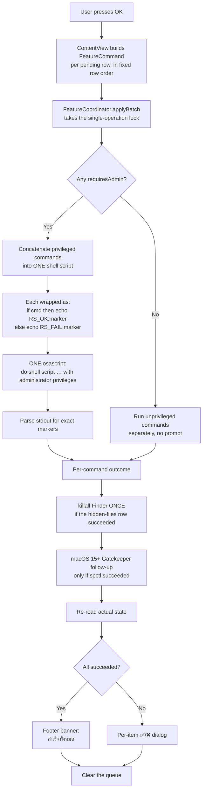

# Features Specification

> **Phase 11.4.** The URL-scheme Shortcuts surface (custom scheme host, `URLActionRouter`,
> `CFBundleURLTypes`, the cold-start queue) was removed by owner decision. All seven actions
> died with it: the §9 action table is gone, the in-app hotkeys are the only keyboard
> surface (⌘Q ⌘W ⌘M ⌘D ⌘↩ ⌘⌫). The Gatekeeper row changed with the same phase: **ON == enforce**
> (`spctl --master-enable`), **OFF == bypass** (`spctl --master-disable`).

Source of truth for every Rosetta Stone capability. Each section below states the purpose, the
exact shell command executed, whether administrator rights are required, the availability matrix,
the UI control type, and the edge cases the implementation must handle.

Notation used throughout this document:

- **(admin)** — the command is executed with root privileges via
  `osascript -e 'do shell script "..." with administrator privileges'`.
- Plain command blocks (no marker) run as the logged-in user with no elevation.

---

## Summary matrix

| # | Feature | UI control | Admin? | Queued? | Intel x64 | Apple Silicon arm64 |
|---|---------|------------|--------|---------|-----------|---------------------|
| 1 | Run at Startup | Toggle | **Yes** (admin) | ✅ | ✅ Available | ✅ Available |
| 2 | Gatekeeper | Toggle (ON = enforce) | **Yes** (admin) | ✅ | ✅ Available | ✅ Available |
| 3 | Hidden Files | Toggle (ON = show) | No | ✅ | ✅ Available | ✅ Available |
| 4 | Auto Boot | Toggle | **Yes** (admin) | ✅ | ✅ Available | ⛔ Greyed + lock icon |
| 5 | Rosetta 2 | Install button | **Yes** (admin) | ✅ | ⛔ Greyed | ✅ Available |
| 6 | Spotlight Rebuild | Button | **Yes** (admin) | ✅ | ✅ Available | ✅ Available |
| 7 | DNS Flush | Button | **Yes** (admin) | ✅ | ✅ Available | ✅ Available |
| 8 | Clear System Cache | Button | **Yes** (admin) | ✅ | ✅ Available | ✅ Available |

**Queued?** describes the **panel** only: a ✅ row is staged and committed by the master
**OK** button. The menu-bar controls bypass the queue and run immediately — see §10.5.

### Privilege matrix

| # | Feature | Writes to | Elevation prompt | Reversible via app? |
|---|---------|-----------|------------------|--------------------|
| 1 | Run at Startup | `~/Library/LaunchAgents/` | Yes | Yes — toggle off |
| 2 | Gatekeeper | System policy daemon | Yes | Yes — toggle on |
| 3 | Hidden Files | `com.apple.finder` prefs | No | Yes — toggle back |
| 4 | Auto Boot | NVRAM | Yes | Yes — toggle on (Intel only) |
| 5 | Rosetta 2 | `/usr/libexec/oah/` | Yes | No — uninstall is manual |
| 6 | Spotlight Rebuild | Spotlight index | Yes | N/A — rebuild is idempotent |
| 7 | DNS Flush | `dscacheutil` / `mDNSResponder` | Yes | N/A — flush is idempotent |
| 8 | Clear System Cache | `/Library/Caches/` | Yes | No — caches regenerate over time |

---

## 1. Run at Startup

> **Queue:** ✅ Yes — staged in the panel and committed by **OK**. Batched as inline work
> (a `FileManager` write, not a shell command), so it never prompts for a password.

### Purpose
Install or remove a per-user `LaunchAgent` so Rosetta Stone is automatically relaunched at every
login — and, in doing so, **choose the app's mode**. This toggle is the app's posture switch:

| Toggle | Mode | Launch | Window | Dock icon | Menu-bar icon |
|--------|------|--------|--------|-----------|---------------|
| OFF (default, first install) | **A — normal app** | panel shown | visible | **yes** | none |
| ON | **B — menu-bar gadget** | hidden | none at launch | **no** (`LSUIElement`) | always visible |

The switch takes effect **live**, in the running process: turning it ON installs the login item,
installs the menu-bar icon and drops the Dock icon; turning it OFF deletes the login item,
removes the menu-bar icon in-process and restores the normal app (Dock icon + window). No
relaunch is involved in either direction.

### Mode B at a glance

- **Left-click the menu-bar icon opens the mini panel** — three switches (Gatekeeper,
  Hidden Files, Run at Startup) with an **OK** / **CANCEL** bar and an **Open Main App**
  button. It stages and commits exactly like the full panel: one password prompt for the
  whole set (`MiniAppView`).
- **Right-click (or Control-click)** opens the full menu: Open Main Window, Toggle Hidden
  Files, Flush DNS, Rebuild Spotlight, Clear System Cache… (confirmed), Diagnostics… (⌘D),
  Quit (⌘Q).
- The window is only ever shown on demand: the menu item or a
  Launch Services / Dock activation.

### Exact command

Installation — writes a property list to the user's LaunchAgents directory **(admin)**:

```bash
# Managed internally as: write plist to a staging file, then (as root)
mkdir -p ~/Library/LaunchAgents
cp <staged plist> ~/Library/LaunchAgents/com.rosettastone.helper.plist
chown <uid> ~/Library/LaunchAgents/com.rosettastone.helper.plist
```

Removal **(admin)**:

```bash
rm -f ~/Library/LaunchAgents/com.rosettastone.helper.plist
```

**There is deliberately no `launchctl` step.** `launchctl bootstrap`/`load` would spawn a
*second* instance immediately (the job is `RunAtLoad`), and `launchctl bootout` during removal
would terminate the very process performing the removal. launchd loads every plist in
`~/Library/LaunchAgents` at the next login by itself, and the running process carries the live
mode switch — see `docs/ARCHITECTURE.md` §2.

The generated `com.rosettastone.helper.plist` runs the app's **absolute executable path**
directly (never `open -a`), passes `--menu-bar-only`, and sets `RunAtLoad = true`,
`ProcessType = Interactive` and `LimitLoadToSessionType = Aqua`.

### State readback
Toggle state = *does `~/Library/LaunchAgents/com.rosettastone.helper.plist` exist?*
No elevation is needed to **read** this; elevation is only required to create/remove.

The same read decides the **mode at launch**: plist exists → mode B (even for a manual
double-click in Finder), plist absent → mode A. The `--menu-bar-only` argument is an
additional, explicit signal used by the login launch.

### Availability

| Platform | Supported | Notes |
|----------|-----------|-------|
| macOS 10.15+ | ✅ | LaunchAgent plist semantics are unchanged across the whole range |
| Intel x64 | ✅ | |
| Apple Silicon arm64 | ✅ | Runs natively; no Rosetta required |

### Edge cases
- The plist path is per-user. Elevation is still used so the file is written outside a
  sandboxed / read-only context; if the process runs unelevated, the write falls back to the
  invoking user's home only.
- A **stale** plist may exist from a previous install at a different path — including one
  written by an older build without `--menu-bar-only`. The app must treat "file exists" as ON
  (and as mode B) even if `launchctl list` shows no loaded job, and offer a clean reinstall
  (off → on) to regenerate it. Diagnostics flags a plist without the flag as an older-build
  item.
- If the user drags the app to a different location after enabling, the plist's
  `ProgramArguments` path becomes stale. The UI must show a warning until the user re-toggles
  the switch (off → on) to regenerate it.
- Cancelling the authorization prompt for ON leaves the app in mode A, and for OFF leaves it in
  mode B. The mode follows the plist, and the plist only changes when the command actually
  runs — the toggle can never claim a posture the disk does not have.
- An already-loaded job from the current session is not unloaded by turning the toggle off. It
  stays loaded until logout but cannot restart the app (there is no `KeepAlive`), and it is not
  loaded at the next login because the file is gone.
- Quitting the app (⌘Q / Quit in the menu) leaves the login item in place: the icon returns at
  the next login, which is exactly what "Run at Startup" promises.

---

## 2. Gatekeeper

> **Queue:** ✅ Yes in the panel. ❌ No (immediate) for the menu-bar immediate action —
> it runs at once with a single auth prompt. On macOS 15+, System Settings is opened
> only **after** a successful batch, never after a failure or a cancellation.
>
> **Phase 11.4 mapping (owner-verified): toggle ON = enforce → `spctl --master-enable`,
> toggle OFF = bypass → `spctl --master-disable`.**

### Purpose
Toggle macOS Gatekeeper's *master switch* between **enforcing** (ON) and
**bypassed / "Anywhere"** (OFF). Useful when a developer needs to run an unsigned or
unnotarized tool (a Homebrew cask, an internal build, a legacy installer) without
Gatekeeper blocking it.

> ⚠️ This is a security-critical toggle. Turning it **off** removes one of the OS's main
> protections against running untrusted software.

### Toggle semantics (Phase 11.4 — **inverted from Phases 1–11**)

| Switch | Meaning | Command at commit |
|--------|---------|-------------------|
| **ON** | Gatekeeper is **enforcing** — unsigned apps are blocked (recommended) | `spctl --master-enable` |
| **OFF** | Gatekeeper's master switch is **bypassed** — unsigned software runs without warnings | `spctl --master-disable` |

Previously ON meant *bypassed*; that semantics is gone. The single mapping lives in
`SystemCommands.gatekeeperShell(enabling:)` so the deferred-queue builder and the
immediate path can never invert each other again, and the off-Mac harness asserts both
directions (`tests/MacProfileTests.swift`).

### Exact command

Bypass **(admin)** — one step on macOS 10.15 – 14, **two steps on macOS 15 and later**:

```bash
spctl --master-disable
```

Enforce **(admin)** — one step on every version:

```bash
spctl --master-enable
```

### Disabling on macOS 15 Sequoia and later (Tahoe 26 / Golden Gate 27)

```swift
runCommand("spctl --master-disable")
openURL("x-apple.systempreferences:com.apple.preference.security?Privacy_AllFiles")
showAlert("กรุณาเลือก 'Anywhere' ใน System Settings เพื่อยืนยันการปิด Gatekeeper")
```
On macOS 15+ the CLI command alone no longer flips the **user-visible** switch: the user must
also choose **Anywhere** under System Settings → Privacy & Security → Security → “Allow
applications from”. The app therefore:

1. runs `spctl --master-disable` (admin) exactly as before,
2. opens System Settings at Privacy & Security, and
3. shows the confirmation alert with the instruction above.

The version rule lives in `SystemCommands.gatekeeperDisableRequiresSystemSettingsConfirmation(majorVersion:)`
(`majorVersion >= 15`), so one call covers Sequoia, Tahoe and Golden Gate. `GatekeeperPolicy` owns
the user-facing half: the deep link and the instruction text. Re-enabling never triggers the
second step.

| macOS | Disable procedure |
|-------|-------------------|
| 10.15 Catalina → 14 Sonoma | **1** — the CLI command is the whole job |
| 15 Sequoia → 27 Golden Gate | **2** — CLI command, then the user picks **Anywhere** in System Settings |

The app never tries to click “Anywhere” itself. System Settings is not scriptable for this
switch, and automating a security downgrade would be indistinguishable from malware.

### State readback

```bash
spctl --status
# "assessments enabled"  -> toggle ON  (Gatekeeper enforcing)
# "assessments disabled" -> toggle OFF (Gatekeeper bypassed)
```

`spctl --status` is readable **without** elevation. Parsing is **exit-code agnostic**:
a non-zero exit never gates the parse — on 14.7.4 `spctl --status` exits 1 while
printing `assessments disabled`, and throwing that stdout away read an already-bypassed
machine as `nil` (`SystemStateReader.parseSpctlStatus(stdout:)`, Phase 11.4).

### Availability

| Platform | Supported | Notes |
|----------|-----------|-------|
| macOS 10.15–12 | ✅ | One-step procedure |
| macOS 13–14 (Ventura / Sonoma) | ✅ | One-step; some policy-managed configurations reject the command — treat a non-zero exit as a failure and show the stderr |
| macOS 15 Sequoia → 27 Golden Gate | ✅ | **Two-step procedure** — see above |
| Intel x64 | ✅ | |
| Apple Silicon arm64 | ✅ | |

### Edge cases
- On **Apple Silicon**, Gatekeeper is stricter and some enterprise MDM configurations
  re-enable it immediately. The app must re-read `spctl --status` after the command completes
  and reflect reality rather than optimistically assuming success.
- On macOS 15+, between the command succeeding and the user choosing “Anywhere”, `spctl
  --status` can still report the old value. The app raises the confirmation alert as soon as
  the command succeeds and re-reads the state afterwards, so the toggle ends up reflecting
  the disk rather than the request.
- The switch, the right-click menu item and the panel's staged change all funnel through
  the one write path (`FeatureCoordinator.command(for:pending:)` /
  `FeatureCoordinator.writeGatekeeper(bypassed:)` via `SystemCommands.gatekeeperShell`),
  so the two-step procedure cannot be skipped on one of them.
- If a corporate MDM profile manages the setting, the toggle will appear to snap back. Surface
  a hint that the setting is policy-managed.
- Never leave the app in a state where the user cannot find how to re-enable it: the
  documentation and the menu-bar menu must both offer the reverse action.

---

## 3. Hidden Files

> **Queue:** ✅ Yes in the panel and in the mini panel. ❌ No (immediate) for the
> right-click menu item.
> **Finder is no longer restarted** (Phase 11) — see below.

### Purpose
Show or hide dotfiles (`.git`, `.env`, `.DS_Store`, …) in Finder. Conventionally the
pathologist's toggle — the single most-used hidden macOS setting.

**Toggle semantics: ON = hidden files are shown.** This is deliberately inverted relative to the
system default so the switch matches user intent rather than the underlying boolean.
(Gatekeeper used to be inverted too; since Phase 11.4 it reads straight — ON = enforcing.)

### Exact command

Show hidden files (no elevation):

```bash
defaults write com.apple.finder AppleShowAllFiles YES
```
…then, in-process, an ordered AppleScript refresh chain (Phase 11.4 — never
`killall Finder`, which destroys scroll position, tabs and downloads):

```applescript
tell application "Finder" to update (target of every window)
```
```applescript
tell application "Finder"
    repeat with w in windows
        try
            update (target of w)
        end try
    end repeat
end tell
```
```applescript
tell application "Finder" to update (path to home folder)
```

Hide hidden files: identical, with `NO` instead of `YES`.

The whole sequence is `SystemCommands.setHiddenFilesShown(_:)`, and it is the **only** write
path — the panel, the mini panel, the menu item and the URL action all reach it through the
shared `command(for:pending:)` table, so no route can drift.

### Why Finder is no longer restarted (Phase 11)

The previous implementation was `defaults write … ; killall Finder`. It worked, and it is why
this row used to be documented as "restarts Finder" — but `killall Finder` terminates the
process every Finder window lives in, so:

- the Dock and desktop blink out and back,
- every open window loses its scroll position, selected files and open tabs,
- anything mid-download in a window restarts,
- and it had to be a `batchPostStep` so a four-change queue did not blink the desktop four times.

`tell application "Finder" to update (target of every window)` — and, once tried, the
per-window loop and the home-folder update — get the same visible result with none of
that: the preference is written
by the same unprivileged `defaults` call (so the durable truth is unchanged and
`SystemStateReader.areHiddenFilesShown()` still reads it back), and running windows are asked to
re-read it. Nothing is destroyed. The chain exists because the single `update every window`
script failed on 14.7.4 with AppleScript error `-1708`: the preference was written but
open windows stayed stale. Each step runs inside its own `try`, the first success wins,
and the winner is logged via `Trace.batch` (`SystemCommands.refreshFinderWindows()`).

**When the whole chain fails** the preference is still written, so this is a success with
a note rather than a failure: the user sees
*"รีเฟรชไม่สำเร็จ กรุณากด ⌘⇧. ใน Finder หรือเปิดหน้าต่างใหม่ / Press ⌘⇧. in Finder or
reopen the window"* in the status banner (`SystemCommands.finderRefreshFailedNote`).

Because `batchPostStep` existed **only** to hold `killall Finder`, nothing sets it any more. The
mechanism is retained in `FeatureCommand` — it is the only place in the batch runner that
understands "this step belongs to the batch, not the row", and the next feature that needs it
should not have to re-derive the sequencing.

### State readback
```bash
defaults read com.apple.finder AppleShowAllFiles
# 1 -> ON (shown)
# 0 -> OFF (hidden)
# (no output) -> OFF
```
Readable **without** elevation. This is the only feature that never prompts for a password.

### Availability

| Platform | Supported | Notes |
|----------|-----------|-------|
| macOS 10.15+ | ✅ | |
| Intel x64 | ✅ | |
| Apple Silicon arm64 | ✅ | |

### Edge cases
- **Automation permission.** Controlling Finder is a TCC-protected operation, so the *first* run
  may prompt for permission to "control Finder". Declining it does **not** break the toggle: the
  preference is still written and a Finder launched later honours it. The refusal is therefore
  reported as **success with a note** and logged to `Trace`, never as a failure — because the
  setting really was applied. This is the one behavioural difference from the old `killall`
  version, which needed no such permission.
- The `AppleShowAllFiles` key is a **per-user, per-Finder** preference. The refresh chain
  tries all three steps in order, so every open window is refreshed by whichever step
  reaches it first — windows stay in agreement.
- If the key has never been written, `defaults read` returns an error rather than `0`. Treat
  "key absent" as OFF, and treat a read failure as "unknown" rather than defaulting to ON.
- The app must not perform this write on app launch as a side effect of reading state.

---

## 4. Auto Boot

> **Queue:** ✅ Yes. Intel MacBook only, and the rule is re-checked at **apply** time: a change
> staged on a row that later became unavailable is refused rather than written to firmware.
> The NVRAM warning is shown at **stage** time, before any password prompt.

### Purpose
Control whether the Mac powers on automatically when the power is restored or the user presses
the power button. Encoded as an NVRAM variable `AutoBoot` using a **3-digit zero-padded binary
value** — the format firmware expects.

- `%00` = binary `000` = **disabled** (toggle OFF)
- `%03` = binary `011` = **enabled** (toggle ON) — the Intel default for "auto boot on"

> Note the deliberate divergence from the other features: here **ON = auto boot enabled**,
> matching the system default. Only Hidden Files uses inverted semantics.

### Exact command

Enable auto boot **(admin)**:

```bash
nvram AutoBoot=%03
```

Disable auto boot **(admin)**:

```bash
nvram AutoBoot=%00
```

### State readback
```bash
nvram AutoBoot
# AutoBoot    %03   -> toggle ON  (auto boot enabled)
# AutoBoot    %01   -> toggle ON  (older firmware also means enabled)
# AutoBoot    %00   -> toggle OFF (auto boot disabled)
# (no output)        -> treat as OFF / unset
```
`%01` is accepted as **enabled** on read: some Intel firmware reports the older value, and
reading it as OFF would invite the user to "fix" a setting that is already correct.

### Availability

Auto Boot needs **two independent facts**, both from `MacProfile` (ADR-008):

1. **Intel** — M-series firmware owns the `AutoBoot` variable and **NVRAM is reset on every
   cold boot**, so it cannot be changed by the user at all.
2. **A lid** — the behaviour is "power on when the lid is opened". An iMac, Mac mini,
   Mac Studio or Mac Pro has none, and on Intel desktop firmware `nvram AutoBoot` is absent
   or inert.

| Machine | Supported | Notes |
|---------|-----------|-------|
| Intel MacBook / MacBook Air / MacBook Pro | ✅ | The only supported combination. T2/T1 firmware exposes `AutoBoot`. |
| Apple Silicon MacBook | ⛔ **Not supported** | No NVRAM to write. Row **disabled with a lock icon**, subtitle and tooltip read **"Apple Silicon reset NVRAM ทุกครั้งที่ cold boot"**. |
| Intel desktop (iMac, Mac mini, Mac Pro) | ⛔ **Not supported** | No lid. Row **disabled with a lock icon**, subtitle and tooltip read **"Desktop Mac ไม่มีฝาเปิด-ปิด"**. |
| Apple Silicon desktop | ⛔ **Not supported** | Both reasons apply; the desktop reason is reported, since it is the more fundamental one. |
| Unrecognised model / architecture | ⛔ **Fail-safe** | `system_profiler` slow, blocked by policy, or absent. Row locked with **"Unknown Mac model — Auto Boot is disabled to stay safe."** |

The first four rows are the whole matrix: exactly **one** of the four combinations is
enabled. Every locked row is **disabled with a lock icon**, never hidden, and **always
carries a reason** — both as the row subtitle and as the hover tooltip.

> **Diagnostics** (`docs/USER-GUIDE.md` §5) reports *Model name*, *Form factor*, *CPU
> architecture*, *Auto Boot supported* and *Auto Boot lock reason*, so a greyed row is
> verifiable from a copied report without a second round-trip.

### Edge cases
- **This is the primary hardware-gated feature**, and the only rule that needs *two* facts
  rather than one. `MacProfile.supportsAutoBoot` requires `formFactor == .laptop` **and**
  `cpuArchitecture == .x86_64`; neither condition is sufficient alone. Disabled, not hidden
  — see the mock-up. The lock must also *explain itself*: SwiftUI's `.help(_:)` is macOS 11+,
  so the row is wrapped in the AppKit-backed `TooltipHost`, and both the subtitle and the
  tooltip carry `MacProfile.autoBootDisabledReason`.
- **Detection has a fallback chain.** `system_profiler SPHardwareDataType` is the primary
  source (it reports the marketing model name); `sysctl -n hw.model` is the fallback. On
  M-series hardware `hw.model` no longer encodes the family (`Mac14,5`), so the fallback
  yields `.unknown` and the row locks — which costs nothing there, because Apple Silicon is
  locked on architecture anyway. See ADR-008.
- The write path is guarded **twice**: the row is greyed by the full rule, and
  `FeatureCoordinator.setAutoBoot` independently refuses anything that is not `x86_64`,
  because that guard must hold even if the profile is ever wrong.
- NVRAM writes persist across reboots, macOS reinstalls, and OS upgrades. There is no per-session
  reset.
- A value outside the expected `%00` / `%01` set must be surfaced as "unknown" rather than
  coerced to a boolean, and the user must be offered an explicit "force enable" / "force disable".
- `nvram` requires root and will fail entirely under a standard user account. Elevation is
  mandatory.
- Writing NVRAM is **not reversible if interrupted** mid-write. Show a confirmation dialog before
  writing, distinct from the standard auth prompt.

---

## 5. Rosetta 2

> **Queue:** ✅ Yes. The "may take several minutes and needs a network connection" warning is
> shown at **stage** time — the user learns what they are queuing *before* the password prompt.
> In a batch this row carries the 900 s timeout, so a slow install is never cut off by the
> 30 s default. ❌ No (immediate) for the menu-bar item and the URL action.

### Purpose
Install Apple's Rosetta 2 translation environment on Apple Silicon, allowing Intel-only
applications and command-line tools to run natively. One-time install; the app only needs to
detect presence, not manage it.

### Exact command

Install **(admin)** — accepts the licence non-interactively:

```bash
softwareupdate --install-rosetta --agree-to-license
```

### Installed-check (no elevation)
```bash
ls /usr/libexec/oah/libRosettaRuntime
# exists   -> already installed -> button shows "Installed" (disabled)
# missing  -> not installed   -> button shows "Install" (enabled)
```

### Availability

| Platform | Supported | Notes |
|----------|-----------|-------|
| macOS 11+ on Apple Silicon | ✅ | Rosetta 2 ships with Big Sur 11.3+ as an optional component |
| macOS 10.15 (Catalina) | ⛔ | Rosetta 2 does not exist on Catalina — no Apple Silicon hardware runs it |
| macOS 11.0–11.2 on Apple Silicon | ⚠️ | Rosetta 2 not bundled until 11.3; the Install button may fail |
| Intel x64 | ⛔ **Not supported** | Rosetta 2 is a no-op / unavailable; the row is **greyed out** |

### Edge cases
- `softwareupdate` can take **several minutes** and produces long output. The UI must show a
  determinate-ish progress state and a cancel affordance, not a frozen window.
- The download requires a **network connection**. A failure here is an error, not a silent no-op.
- The install is **idempotent**: if Rosetta is already present, the command exits quickly with
  "No new software available". The UI should pre-check with the `libRosettaRuntime` probe and
  avoid prompting for a password at all in that case.
- The button must transition to a disabled **"Installed"** state on success and stay there for
  the rest of the process lifetime.
- A user may be running Rosetta 2 *itself* on an Intel app that launched on Apple Silicon; the
  detection path is unaffected because it is a filesystem probe, not an architecture check.

---

## 6. Spotlight Rebuild

> **Queue:** ✅ Yes. ❌ No (immediate) for the menu-bar item.

### Purpose
Force macOS Spotlight to discard and rebuild its search index for the startup volume. Fixes
"Spotlight can't find X" after a mass rename, an OS migration, or an external-drive reshuffle.

### Exact command

Rebuild the index for `/` **(admin)**:

```bash
mdutil -E /
```

### State readback
This feature holds no state — it is a one-shot action button. There is nothing to read back and
nothing to disable in the UI beyond the in-flight state.

### Availability

| Platform | Supported | Notes |
|----------|-----------|-------|
| macOS 10.15+ | ✅ | |
| Intel x64 | ✅ | |
| Apple Silicon arm64 | ✅ | |

### Edge cases
- The rebuild is **slow and CPU/I-O intensive**; Spotlight's indexing will visibly churn for
  several minutes afterwards. The UI must warn the user before starting, and the button must show
  a spinner until `mdutil` exits.
- `mdutil -E /` only affects the **startup volume**. If Spotlight indexing is *disabled* for that
  volume (`mdutil -i off`), erasing the index has no effect until indexing is re-enabled. Detect
  this with `mdutil -s /` and warn accordingly.
- On macOS 10.15+, `mdutil -E /` requires root; without elevation it returns
  `Error: unknown index while trying to erase`.
- The command returns success quickly even though the actual rebuild runs in the background.
  Do not report "done" as meaning the index is populated.

---

## 7. DNS Flush

> **Queue:** ✅ Yes. ❌ No (immediate) for the menu-bar item.

### Purpose
Clear the DNS resolver cache and restart the `mDNSResponder` (multicast DNS) daemon so the Mac
immediately re-resolves hostnames. The standard fix for "the network is up but nothing loads"
after a VPN, DNS-filtering tool, or `/etc/hosts` change.

### Exact command

Flush the cache **(admin)** — both parts are required:

```bash
dscacheutil -flushcache
killall -HUP mDNSResponder
```

### State readback
None — transient action button with no persistent state.

### Availability

| Platform | Supported | Notes |
|----------|-----------|-------|
| macOS 10.15+ | ✅ | |
| Intel x64 | ✅ | |
| Apple Silicon arm64 | ✅ | |

### Edge cases
- **Order matters.** `dscacheutil -flushcache` must run *before* the `SIGHUP`, otherwise the
  responder is reloaded with the stale cache still in place. The implementation must chain them,
  not run them concurrently.
- `killall -HUP mDNSResponder` causes a brief (sub-second) network blip as connections are
  renegotiated. Active downloads and VPN sessions may drop. Warn the user.
- If `mDNSResponder` is not running (rare), `killall` exits non-zero. Treat "cache flushed" as the
  success criterion and suppress the `killall` error.
- Do **not** add a `networksetup -flushdns` invocation on top: it requires enumerating every
  network service and adds failure modes without benefit on modern macOS.

---

## 8. Clear System Cache

> **Queue:** ✅ Yes. The confirmation dialog is raised at **stage** time — before the password
> prompt — and remains *additional* to it, never a replacement. ❌ No (immediate) for the
> menu-bar item, which confirms too.

### Purpose
Delete the contents of the shared system cache directory at `/Library/Caches/`. The blunt
instrument of last resort for application weirdness, stale permission caches, and corrupted
system-level caches. Caches are regenerated by the OS and applications as they are next needed.

### Exact command

Delete system caches **(admin)**:

```bash
rm -rf /Library/Caches/*
```

### State readback
None — transient action button with no persistent state.

### Availability

| Platform | Supported | Notes |
|----------|-----------|-------|
| macOS 10.15+ | ✅ | |
| Intel x64 | ✅ | |
| Apple Silicon arm64 | ✅ | |

### Edge cases
- ⚠️ **Destructive.** This is the highest-risk action in the app. It requires an explicit
  confirmation dialog *in addition to* the macOS authentication prompt, and the confirmation must
  state that open applications may misbehave and may need to be restarted.
- The feature is **retained deliberately** rather than removed or buried: it is a documented,
  requested capability. What it is *not* allowed to be is quiet about its risk. The warning is one
  constant (`FeatureID.clearSystemCacheWarning`) shared by the panel sheet, the status-item menu
  and the URL-scheme confirmation, so the three can never disagree; it opens with the
  owner-specified Thai line **"⚠️ การล้าง System Cache อาจทำให้บางแอปช้าลงชั่วคราว"** and then
  the English detail. The right-click menu item reads "Clear System Cache…", the ellipsis marking
  the confirmation.
- The glob `*` does not match dotfiles. A literal `rm -rf /Library/Caches/*` will not remove
  hidden entries; this is intentional and must not be "fixed" by switching to a different glob,
  which would risk removing the directory's own metadata.
- Some cache directories are SIP-protected and will simply be skipped; the command still exits 0.
  Do not report a count of deleted files as a success metric.
- Applications with running processes may hold open file handles to deleted files. Their
  behaviour is undefined until restarted — this is expected and must be communicated up front.
- There is **no undo**. No automated surface may ever offer a "clear cache" action
  without the same confirmation gate.

---

## 9. URL-scheme actions — **removed (Phase 11.4)**

This section used to register the custom scheme via `CFBundleURLTypes`
and list seven actions (`open-app`, `toggle-gatekeeper`, `toggle-hidden-files`,
`flush-dns`, `rebuild-spotlight`, `clear-cache`, `install-rosetta`) plus a cold-start
queue (`AppDelegate.pendingURLs`, ceiling 10, `drainPendingURLs()`).

The whole surface was removed by owner decision: `URLActionRouter.swift` deleted, the
`CFBundleURLTypes` block deleted from `Info.plist`, the AppKit open-URL plumbing
(`application(_:open:)`, `handle(urls:)`, `enqueue`, `drainPendingURLs`, the
`maxPendingURLs` ceiling, the `isReady` gate) removed from `AppDelegate`, the
`URLActionHandling` conformance (and the URL-only `toggleGatekeeper()` coordinator entry
point and `performDestructiveAction`) removed from `MenuBarController`, and every
reference scrubbed from the docs. The in-app hotkeys (⌘Q ⌘W ⌘M ⌘D ⌘↩ ⌘⌫) and the
programmatic main menu are untouched.

(A doc-level proof note: the grep looks for the literal scheme host, which is why this
file spells it `rosettastone` + `://` everywhere it must be mentioned. `CHANGELOG.md` is
where the host survives as a historical record.)

---

## 10. The deferred queue (Apply / Cancel)

Phase 9 changed **when** the panel acts, not **what** it can do. Every panel row is now a staging
area: pressing a switch records an intent, and two master buttons at the bottom of the panel
commit or discard the whole set.

### 10.1 Actual state vs pending state

Two different values exist for every row, and keeping them apart is the entire mechanism:

| | Meaning | Source | Survives a state re-read? |
|---|---------|--------|---------------------------|
| **Actual state** | What the system really is right now | `SystemStateReader` — `spctl`, `defaults`, `nvram`, the plist on disk, the Rosetta runtime probe | Yes — it is re-read after **every** write |
| **Pending state** | What the user asked for in this session | `ContentView.pendingChanges`, in memory only | No — it is discarded when the window's view is recreated |

The two rules that follow from this:

1. **The switch shows the pending value**, because that is what the user just asked for and
   hiding it would make the panel lie about their own action.
2. **The orange ● marks the disagreement.** It is drawn beside the row title whenever a pending
   entry exists. An entry that equals the actual state is *removed* rather than stored, so a
   switch toggled on and then back off leaves no dot behind.

### 10.2 The master buttons

| Button | Shortcut | Enabled when | Effect |
|--------|----------|--------------|--------|
| **CANCEL** | — | Queue is non-empty and nothing is in flight | Discards every pending entry. **Runs no command** and raises no confirmation — nothing was changed, so there is nothing to confirm. |
| **OK** | ⌘↩ on macOS 11+; no shortcut on 10.15 | Queue is non-empty and nothing is in flight | Builds one command per pending row and commits them as a single batch. |

Both are disabled whenever the queue is empty, which is what teaches the rule: Apply is not
available until something is staged.

### 10.3 Batch execution

Pressing ✅ commits the queue through `SystemCommands.runBatched`:



Guarantees the batch must uphold:

- **At most one password dialog per Apply**, regardless of how many privileged rows are queued.
- **One failure never aborts the rest.** Commands are joined with `;` and each is wrapped in its
  own `if/then/else`; `set -e` is never used.
- **Silence is failure, never success.** A command that prints no marker is reported as failed,
  because a batched script's exit status is always `0`.
- **Markers are exact matches**, never prefix matches, so `RS_OK:install-rosetta-extra` can
  never satisfy the `install-rosetta` row.
- **Cancellation is silent and aborts the whole batch.** Dismissing the Authorization dialog
  reports **every** row as cancelled — privileged *and* unprivileged — and the unprivileged half is
  then **not run**. Running the LaunchAgent write while Gatekeeper silently did not change would be
  exactly the half-applied state the queue exists to prevent. The queue is also left intact, so
  ✅ can simply be pressed again.
- **The batch takes the same lock as a single feature**, so it can never run beside a menu-bar
  toggle and raise two dialogs at once.
- **The macOS 15+ Gatekeeper step runs only on success.** Opening System Settings after a failed
  or cancelled `spctl` would contradict the message the user is looking at.

---
## Cross-cutting behaviour

### Row order (owner-specified, Phase 11)

Reordered in Phase 11. Gatekeeper and Hidden Files lead because they are the two people
reach for constantly; **Run at Startup moved down to fourth** so the switch that governs the
app's entire posture is not the first thing under the user's cursor and cannot be flipped by
accident. The constant is `FeatureID.panelRowOrder`; `ContentView.rows` names each row
explicitly, because a generated order would need a `switch` inside the view hierarchy to
decide which rows are toggles, which are one-shot buttons, and which are Quick Tools.

| Order | Row | Control |
|-------|-----|---------|
| 1 | Gatekeeper | Toggle |
| 2 | Auto Boot | Toggle (greyed + 🔒 on Apple Silicon) |
| 3 | Hidden Files | Toggle |
| 4 | Run at Startup | Toggle |
| 5 | Rosetta 2 | Install button (greyed on Intel) |
| — | *(separator)* | |
| 6 | Quick Tools — Spotlight | Button |
| 6 | Quick Tools — DNS | Button |
| 6 | Quick Tools — Cache | Button |

The display order is deliberately **not** `FeatureID.allCases`. `allCases` is the order a
deferred batch commits in; it answers "what commits first", not "what the user sees".
Pinning one to the other would make a cosmetic change a behaviour change.

### Keyboard shortcuts

| Shortcut | Action | Where |
|----------|--------|-------|
| ⌘↩ | Commit the queue (**OK**) | Main panel, mini panel — macOS 11+ only |
| ⌘⌫ | Discard the queue (**CANCEL**) | Main panel, mini panel — macOS 11+ only |
| ⌘Q | Quit Rosetta Stone | Anywhere |
| ⌘W | Hide the panel back to the menu bar | Anywhere |
| ⌘M | Show the mini panel | Anywhere |
| ⌘D | Diagnostics | Anywhere |
| ⌘H | Hide the application | Anywhere |

Both `keyboardShortcut` overloads are macOS 11+ in this SDK, so the ⌘↩ / ⌘⌫ bindings are
applied through `ConditionalCommandReturnShortcut` / `ConditionalCommandDeleteShortcut` and
are **deliberately absent on the 10.15 floor** rather than reaching for an API that does not
exist there. The ⌘Q / ⌘W / ⌘M / ⌘D bindings are AppKit `NSMenuItem`s and therefore work on
every supported version — which is exactly why the main menu is built in code rather than
left to a nib (see `AppDelegate.installMainMenu()`).

### Toggle semantics
| Feature | ON means |
|---------|---------|
| Run at Startup | The LaunchAgent plist exists — the app is a menu-bar gadget (mode B) |
| Gatekeeper | **Gatekeeper is enforcing** (Phase 11.4 — ON = protected; the old inverted meaning is gone) |
| Hidden Files | **Hidden files are shown** (inverted vs. the system default) |
### 10.4 Which actions are queued

| Feature | Queued? | Notes |
|---------|---------|-------|
| 1. Run at Startup | ✅ | Batched as **inline** work — no shell, no elevation, because the plist lives in the user's own `~/Library` |
| 2. Gatekeeper | ✅ | ON = enforce, OFF = bypass. macOS 15+ opens System Settings **after** a successful batch (and only when the fresh read agrees the machine is bypassed) |
| 3. Hidden Files | ✅ | Ordered AppleScript refresh chain runs inline, once per batch |
| 4. Auto Boot | ✅ | Re-checked at apply time; a locked row is refused rather than written |
| 5. Rosetta 2 | ✅ | "May take several minutes" is warned at **stage** time, before the password prompt |
| 6. Spotlight Rebuild | ✅ | — |
| 7. DNS Flush | ✅ | — |
| 8. Clear System Cache | ✅ | Confirmation is shown at **stage** time, and is *additional* to the auth prompt |

### 10.5 What deliberately bypasses the queue

Two routes run **immediately** and never touch `pendingChanges`:

| Route | Why |
|-------|-----|
| The mini panel's **OK** → Gatekeeper staged change, committed as its own batch | Still one queue, one lock, one password prompt. |
| Menu-bar **right-click** menu items | Shortcuts, not batch configuration. |

The rationale: the queue exists to make *configuring several things at once* cheap. A shortcut is
already a single explicit command, so deferring it adds a step and buys nothing.

### 10.6 Feedback for a batch

| Outcome | What the user sees |
|---------|--------------------|
| Every row succeeded | Footer banner: **สำเร็จทั้งหมด** · N change(s) applied. No dialog. |
| Any row failed | Footer banner with the failure count **and** a per-item dialog listing **every** row with a ✅ or ❌, so the successes are visibly confirmed too. **All pending dots clear** — see below. |
| Authorization dismissed | Nothing. The queue is kept and the pending dots remain; the user can press **OK** again. |

### 10.7 OK empties the queue, always (Phase 11)

**Owner decision.** When a batch completes — successfully or not — **every** pending dot
clears. The switches then repaint from the system state the coordinator re-reads afterwards.

This reverses the Phase 9 behaviour, where a failed row kept its dot so that pressing **OK**
again was a retry. The reason for the change: a permanently half-staged panel looks identical
to "I have work queued", and the single most confusing thing this panel can do is be ambiguous
about what pressing **OK** will do. Nothing is lost — the per-item dialog names each failure
and why, so a retry is one click per row.

**The one exception** is a dismissed Authorization dialog. That is an answer of "not now"
rather than a result: no command ran, so the queue survives and **OK** can simply be pressed
again without re-staging.

**CANCEL** clears the queue and calls `loadState()`, which re-reads every feature
unprivileged. So "discard" means *reset to what the system actually reports*, not *reset to
what I remember*.

---
| Auto Boot | Auto boot is enabled |

Two of the four toggles are inverted. The UI must label them unambiguously (for example
"Gatekeeper — Off" vs "Gatekeeper — Bypassed") so a user never misreads the switch position.

### Concurrency
- Only one privileged operation may be in flight at a time. A second request while one is
  running must be queued or rejected with an explanatory message — never two simultaneous
  `osascript` auth dialogs. **A batch holds the same lock as a single feature**, so pressing
  ✅ while a menu-bar toggle is running is rejected rather than interleaved.
- Quick Tools buttons must disable themselves for the duration of their own execution.
- The master Apply/Cancel buttons are disabled while anything is in flight, so a batch can never
  be started from underneath another operation.

### Feedback
Every action produces exactly one terminal state: **success**, **cancelled by the user at the
auth prompt**, or **failed with a message**. No action may fail silently.

A **batch** produces one terminal state *per row* rather than one for the batch: a ✅/❌ per
item, so one failing command never hides the six that worked. See §10.6.


